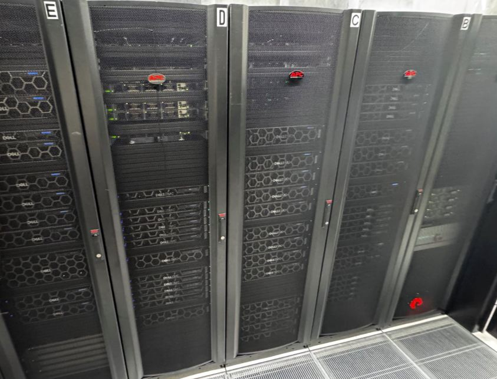

# Research HPC Cluster (Aoraki)

!!! overview "On this Page"
      - What the HPC Research Cluster is
      - Cluster computing resources available
      - Resource term definitions

Shared computing resources available to Otago researchers include high performance computing, fast storage, GPUs and virtual servers.

## Otago Resources

The Aoraki Research Cluster provides researchers with access to shared resources, such as **CPUs, GPUs, and high-speed storage**.
Also available are specialised software and libraries optimised for scientific and data science computing.

If you need special software or configurations, please ask the eResearch Support team at {{ support_email }}.

## Cluster Overview

{ .left }

We offer a variety of SLURM partitions based on different resource needs. The default partition (`aoraki`) provides balanced compute and memory capabilities. Additional partitions include those optimized for GPU usage and those with expanded memory capacity.

!!! note
      Every cluster node reserves 2 cores for the OS and Weka storage, reducing the compute cores available to jobs by 2.

### Individual Job Limitations

This table lists the _default_ maximum resources that can be requested for individual jobs. If your work requires alterations to these limitations please contact {{ support_email }} to discuss how these can be accommodated.

{{ read_csv('docs/assets/tables/limits.csv') }}

- **Partition**: Name of the partition. An asterisk (`*`) denotes the default partition; a caret (`^`) denotes new hardware where access is limited and must be requested from {{ support_email }}.
- **Time Limit (Days)**: Maximum time a job can run in that partition. The time limit for running jobs can be extended upon request. In such cases, the extended time limit may exceed the partition's standard wall time.
- **Max Running Jobs**: The maximum number of simultaneously running jobs. Subsequent jobs will wait in the queue.
- **Max CPU**: Maximum number of CPU cores available to be requested on a node.
- **Max Mem**: The maximum amount of memory (in GB) available to be requested on each node in the partition.
- **Max GPUs**: The maximum number of GPUs that can be requested on a node for a job. Shown as `-` for partitions with no GPUs.
- **Num Nodes**: Number of nodes available in the partition.
- **NodeList**: The specific nodes allocated to that partition.

`aoraki_small` and `aoraki_short` are specialized partitions that utilize typically idle CPU cores on GPU nodes, designed to handle small or short-duration jobs efficiently.

#### Additional limits

* Maximum of 5000 submitted jobs per user (OnDemand jobs are not counted in this limit)
* Jobs requesting GPUs or running through OnDemand are limited to a single node
* OnDemand is limited to 10 running jobs per user
* Users are limited to 2 simultaneously running GPU jobs per GPU partition. Any additional GPU jobs will remain queued until resources become available

### Individual Node Specifications

Within the cluster there are different hardware configurations to accommodate a wide range of use cases. Some jobs require specific hardware or may benefit from running on a particular node type.

{{ read_csv('docs/assets/tables/specs.csv') }}

- **GPU**: `-` indicates the node has no GPU. Where shown, interconnect bandwidth (e.g. NVLink) and CUDA version are noted where known.
- **CPU Clock**: Base clock speed, shown where recorded. `-` indicates this wasn't recorded for that node (currently only tracked for CPU-only nodes).
- **standalone**: dedicated GPU workstations outside the main `aoraki[NN]` node numbering.

!!! related-pages "What's next?"

    * [Get access to the cluster](../getting_started/access/access_overview.md)
    * [Move transfer data](../storage/data_transfer/data_transfer_overview.md)
    * [Run a job](../getting_started/running/running_jobs_overview.md)
