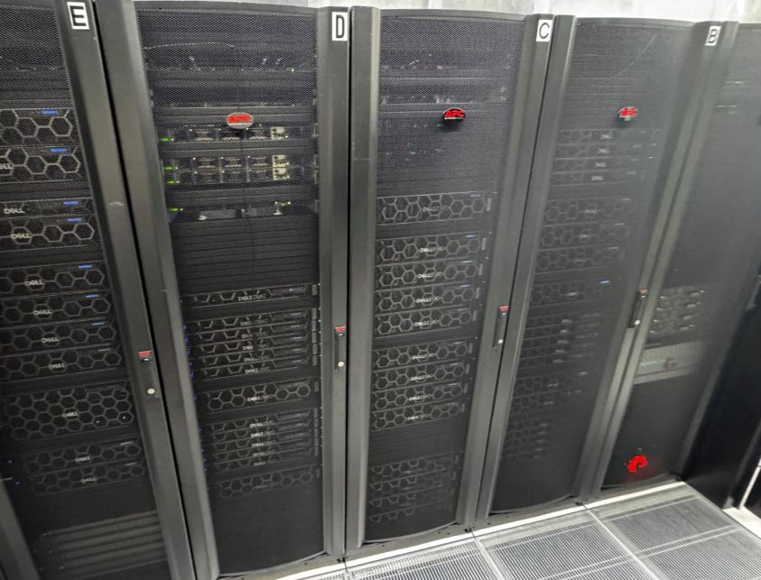
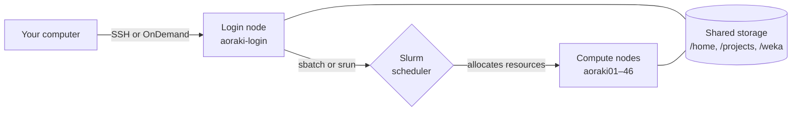

# Research HPC Cluster (Aoraki)

!!! overview "On this Page"
      - What the Aoraki Research Cluster is and how it is put together
      - The partitions you can run jobs in, and how to choose between them
      - The limits that apply to your jobs and to your account
      - The hardware in each node

The Aoraki Research Cluster is the University of Otago's shared high performance computing system. It gives researchers access to **CPUs, GPUs, large-memory nodes and high-speed storage**, along with specialised software and libraries for scientific and data science computing.

{ .left }

It is *shared* infrastructure, and that is the main thing that makes it different from a workstation. You are not limited to the hardware on your desk, but you also do not get a machine to yourself: you describe the resources your work needs, and a scheduler decides where and when it runs.

If you need software or a configuration that is not already available, ask the eResearch Support team at {{ support_email }}.

## How the Cluster is Put Together

```mermaid
graph LR;
    A["Your computer"] -->|"SSH or OnDemand"| B["Login node<br/>aoraki-login"]
    B -->|"sbatch or srun"| C{"Slurm<br/>scheduler"}
    C -->|"allocates resources"| D["Compute nodes<br/>aoraki01–46"]
    B --- E[("Shared storage<br/>/home, /projects, /weka")]
    D --- E
```

**Login node** — where you land when you connect over [SSH](../getting_started/access/login_ssh.md) or through [OnDemand](../getting_started/software/OnDemand/ondemand.md). Use it to edit scripts, move files around and submit work. It is shared by everyone, so it is not the place to run your analysis — see [Login Node Usage](guidelines/login_node_usage.md).

**Compute nodes** — where your work actually runs. You do not log in to them directly; you reach them by asking Slurm for an allocation.

**Slurm** — the scheduler. You tell it how many cores, how much memory, how long, and whether you need a GPU, and it finds a node that can satisfy that request. See [Running Jobs](../getting_started/running/running_jobs_overview.md).

**Shared storage** — every node sees the same files, so a job on any compute node can read the data you put in `/home`, `/projects` or `/weka`. See the [Storage Overview](../storage/storage_options.md).

!!! tip "Getting started"
    If you have not used the cluster before, [get access](../getting_started/access/access_overview.md) first, then work through [Running Jobs](../getting_started/running/running_jobs_overview.md). You can also use most of the cluster from your browser through [OnDemand](../getting_started/software/OnDemand/ondemand.md), which writes the Slurm job for you.

## Partitions

A **partition** is a named group of nodes with its own limits on job size and run time. Every job goes to a partition — if you do not name one, it goes to `aoraki`, the default.

Choosing well matters: a partition with the hardware you need but a long queue may start later than a smaller one that is mostly idle.

### Choosing a Partition

| If your job needs… | Use | Notes |
| :-- | :-- | :-- |
| Nothing in particular | `aoraki` | The default. Balanced cores and memory, 27 nodes, so usually the quickest to start. |
| Lots of cores | `aoraki_bigcpu` | Up to 252 cores on a node. |
| Lots of memory | `aoraki_bigmem` | Up to 2000 GB on a node. |
| Fast single-core performance | `aoraki_fastcore` | Fewer cores per node, but the highest clock speed on the cluster. |
| To run for longer than 14 days | `aoraki_long` | Up to 30 days. |
| A GPU | `aoraki_gpu` | Gives you any free GPU. Use a specific partition such as `aoraki_gpu_H100` when your work needs that model or that much GPU memory. |
| Very little, or not for long | `aoraki_small`, `aoraki_short` | These use the normally idle CPU cores on GPU nodes, so small and short jobs can start without waiting for a general-purpose node. |

Before you submit, [Current Utilisation](../getting_started/current_utilisation.md) shows how busy the cluster is right now.

### Partition Limits

These are the *default* maximum resources a single job can request. If your work needs more, contact {{ support_email }} to discuss how it can be accommodated.

Table: Default per-job limits for each partition

{{ read_csv('docs/assets/tables/limits.csv') }}

!!! info "Reading this table"
    - **Partition** — an asterisk (`*`) marks the default partition. A caret (`^`) marks new hardware where access is limited and must be requested from {{ support_email }}.
    - **Time Limit (Days)** — how long a job may run. This can be extended on request, and an extension may exceed the partition's standard wall time.
    - **Max Running Jobs** — how many of your jobs can run at once in that partition. The rest wait in the queue.
    - **Max CPU** — cores you can request on a single node.
    - **Max Mem** — memory (GB) you can request on a single node.
    - **Max GPUs** — GPUs you can request on a node for one job. `-` means the partition has no GPUs.
    - **Num Nodes** / **NodeList** — how many nodes are in the partition, and which ones.

!!! note
      Every cluster node reserves 2 cores for the OS and Weka storage, so the cores available to jobs are 2 fewer than the node's total.

### Limits on Your Account

Alongside the per-job limits above, a few limits apply across everything you submit:

| Limit | Value |
| :-- | :-- |
| Submitted jobs | 5000 per user (OnDemand jobs are not counted) |
| Running GPU jobs | 2 per GPU partition — further GPU jobs stay queued |
| Running OnDemand jobs | 10 per user |
| Nodes per job | GPU jobs and OnDemand jobs are limited to a single node |

## Node Hardware

The cluster is not uniform. Nodes differ in cores, memory and GPU, and some work benefits from — or requires — a particular type.

Table: Hardware configuration of each node type

{{ read_csv('docs/assets/tables/specs.csv') }}

!!! info "Reading this table"
    - **GPU** — `-` means the node has no GPU. Interconnect bandwidth (e.g. NVLink) and CUDA version are noted where known.
    - **CPU Clock** — base clock speed, where recorded. `-` means it was not recorded for that node; currently only tracked for CPU-only nodes.
    - **standalone** — dedicated GPU workstations outside the main `aoraki[NN]` node numbering.

!!! related-pages "What's next?"

    * [Get access to the cluster](../getting_started/access/access_overview.md)
    * [Move data on and off the cluster](../storage/data_transfer/data_transfer_overview.md)
    * [Run a job](../getting_started/running/running_jobs_overview.md)
    * [See how busy the cluster is](../getting_started/current_utilisation.md)
