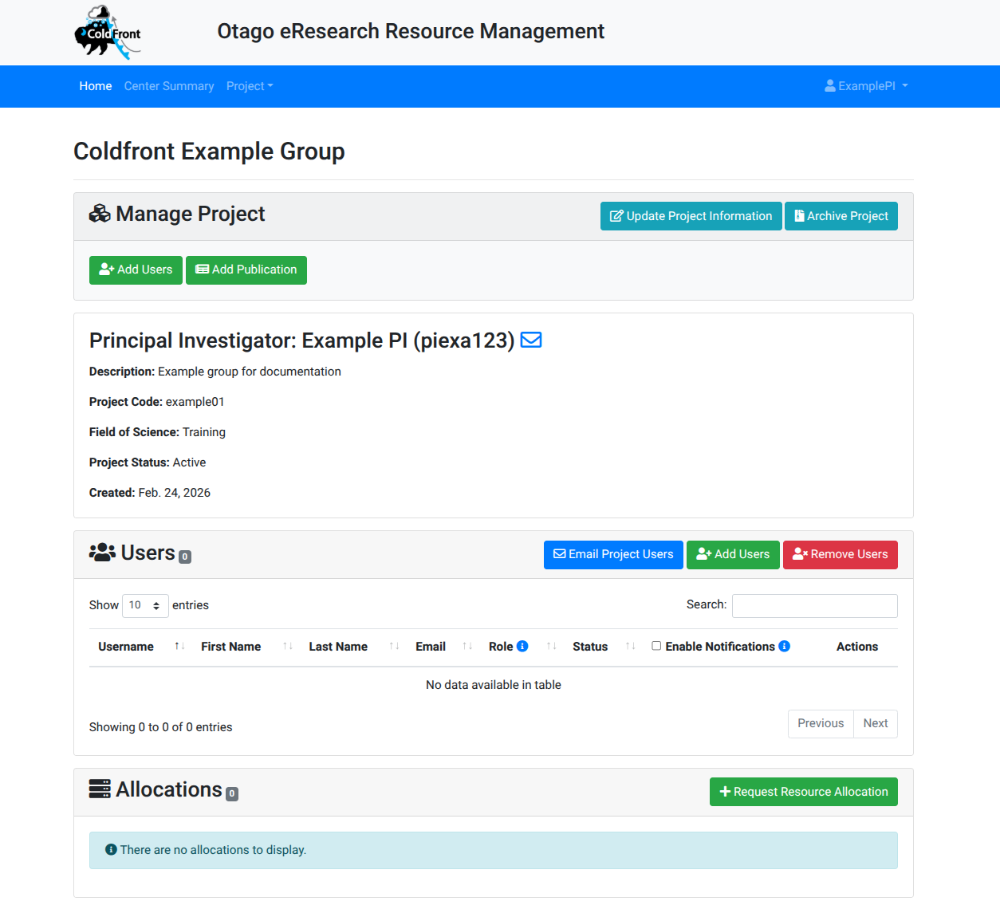
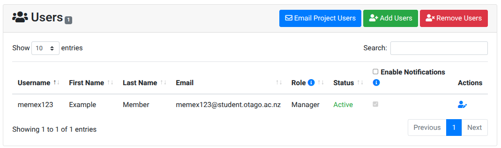
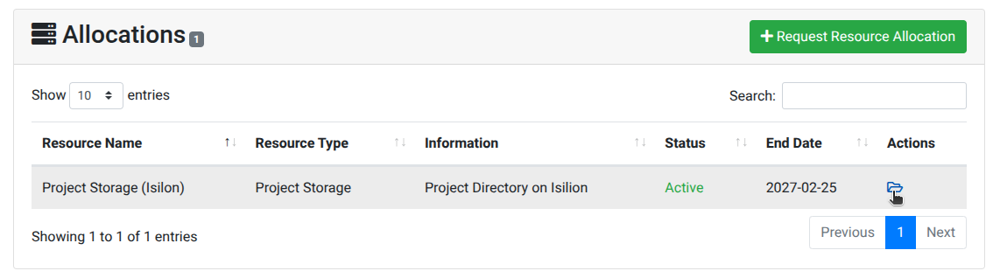
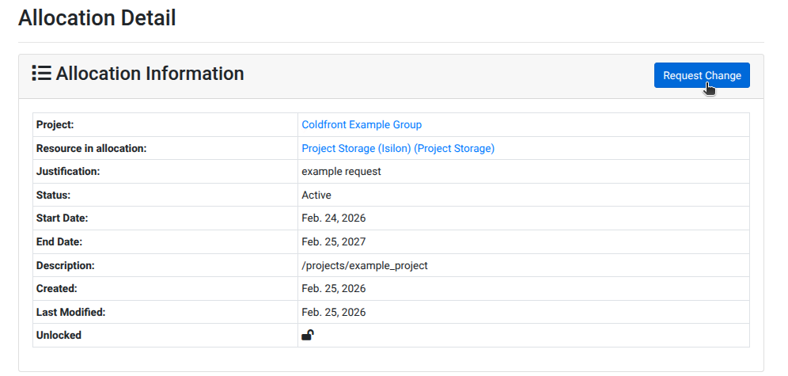
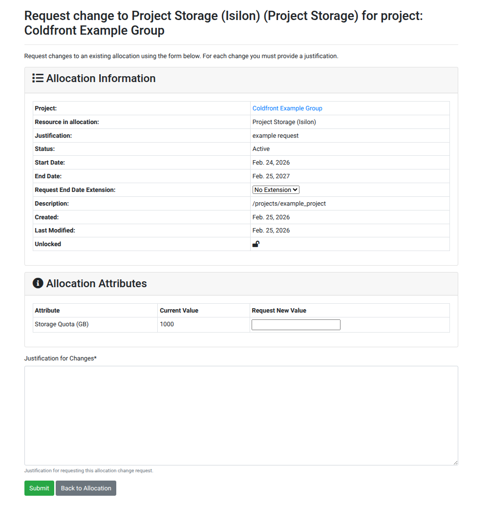

# Allocation Management

The instructions on this page apply to Project Owners or their delegates for the management of a project.

If you do not have a current project allocation, please get your group leader to fill in this [project allocation request form](). <!-- FIXME create and link the form -->

!!! note
    Updates to a project do not happen instantaneously, but trigger a notification for the Solutions team to action.

## Adding or Removing users

After logging in to [https://coldfront.otago.ac.nz](https://coldfront.otago.ac.nz) select the project you would like to add or remove a user from

### Adding a User

!!! info
    The role of "Manager" enables users to manage the project on your behalf - adding/removing users, applying for quota increases etc.
    The role of "User" only enables the user access to the project.
    

### Editing a User Role

If you would like to reassign the role of a user, this is done clicking the person icon in the row with their name.

### Removing a User

Find the Users panel for the Project

## Applying for an Increased Quota

!!! info
    You may be contacted to discuss your data currrent and proposed usage before a decision is made on the quota change.

## Applying for WEKA
