# Project Management

The instructions on this page apply to Project Owners or their delegates for the management of a project.

If you do not have a current project allocation, please get your group leader to fill in this [project allocation request form](../../../storage/storage_request.md). <!-- FIXME create and link the form -->

Resources on Aoraki are managed through Coldfront ([https://coldfront.otago.ac.nz](https://coldfront.otago.ac.nz)). A project is created with a project owner (PI) and this project can then have storage and cluster allocations provisioned for it. Coldfront enables PIs or users with the "manager" role to self manage access for other users to the project and it's resources.

See the [Coldfront Projects Documentation](https://docs.coldfront.dev/en/stable-1.1.x/howto/projects/) for more information about projects in Coldfront.

!!! note
    Updates to a project do not happen instantaneously, but trigger a notification for the Solutions team to action. Storage changes are generally actioned by the end of the next business day.

## Viewing a Project

After logging in to [https://coldfront.otago.ac.nz](https://coldfront.otago.ac.nz) select the project you would like to add or remove a user from

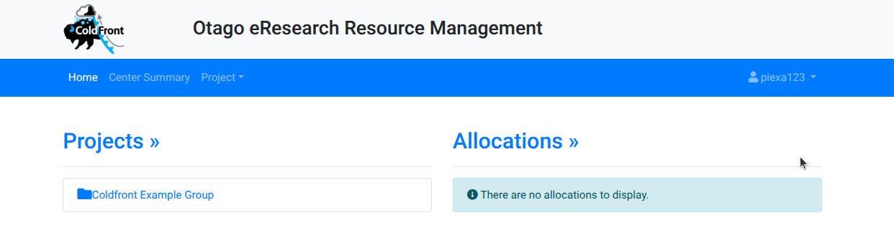

 

The project page gives an overview of the status of the project, users that are part of the project, and the resources such as storage allocations or cluster account details your project has access to.

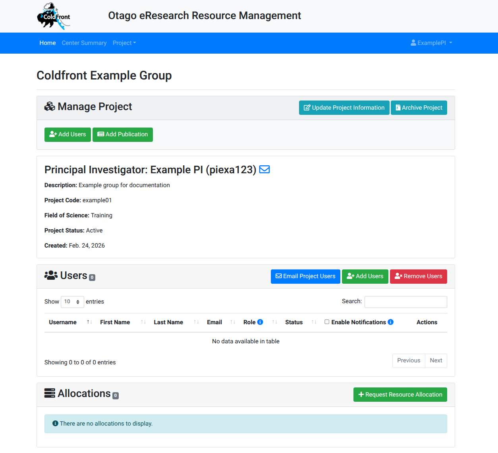

 

This page lets the PI or a member with the "manager" role update allocations, and access of members. Members with the "user" role see a "read-only" page.

### Adding a User

Before users can access project resources they must first be added to the project by either a PI or a project member with a "manager" role.

To add a new user to the project, select the "Add Users" button on the Users panel.

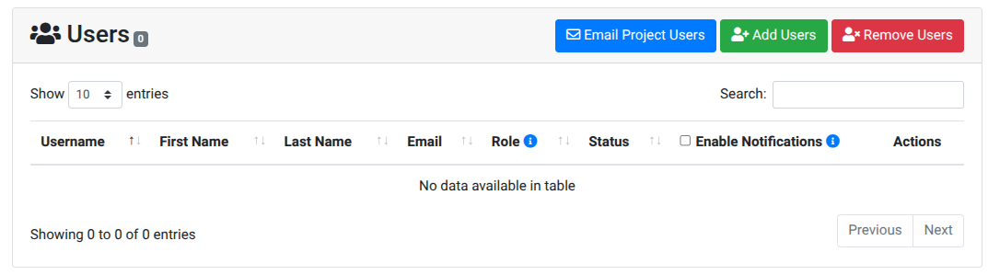

 

Use "Exact Username Only" to search for the users' username if you know it, or you can use "All Fields" to search for a name. Once found, select the role you want the user to have within the project.
Select the role to assign the user for the project.

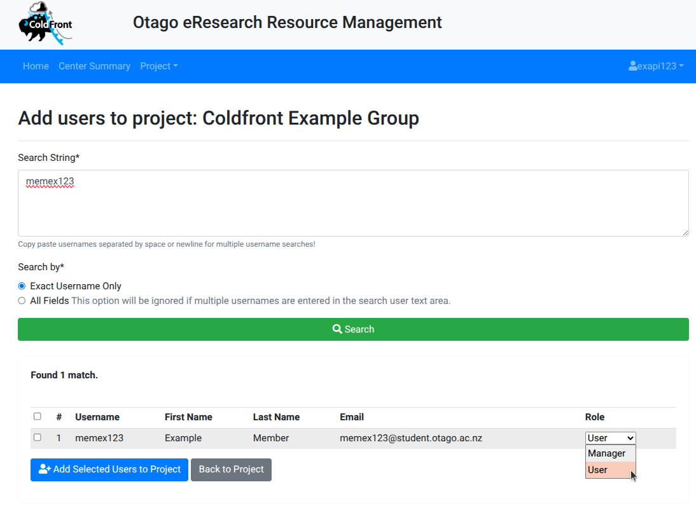

!!! info
    The role of "Manager" enables users to manage the project on your behalf - adding/removing users, applying for quota increases etc.
    The role of "User" only enables the user access to the project. This can be altered later by following [Editing a user role](#editing-a-user-role).

!!! tip
    If you have allocations this is the easiest time to select which allocations a user should have access to. Otherwise after adding the user you will need to manually add the user to each allocation individually.
    
    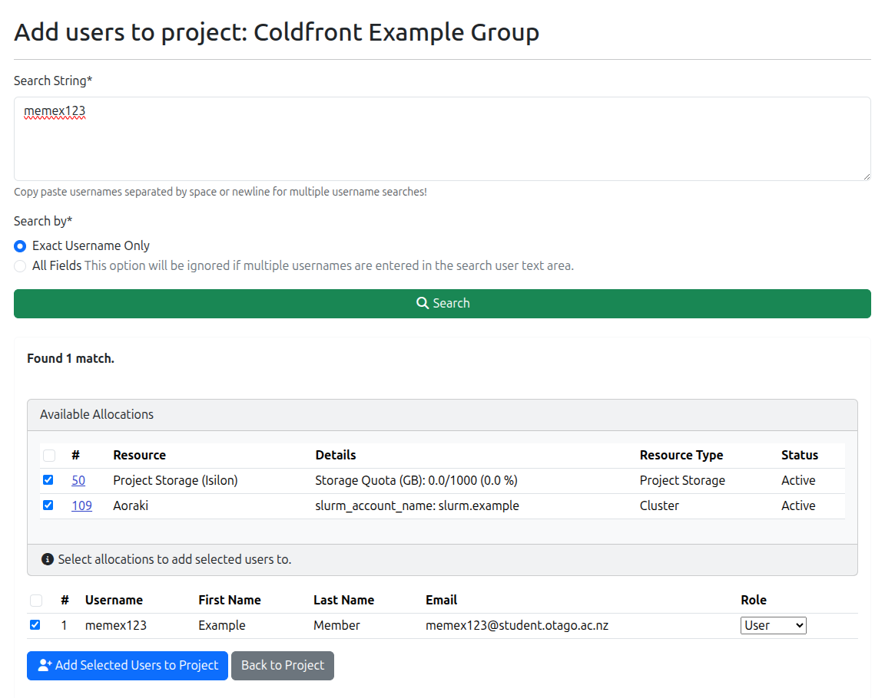

 

Once the role has been selected, ensure that the checkbox next to the user is selected and click "Add Selected Users to Project".

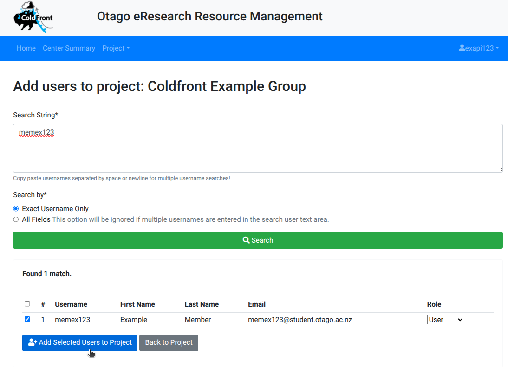

 

Once a user has been added to the project they should appear in the Users panel for the project.

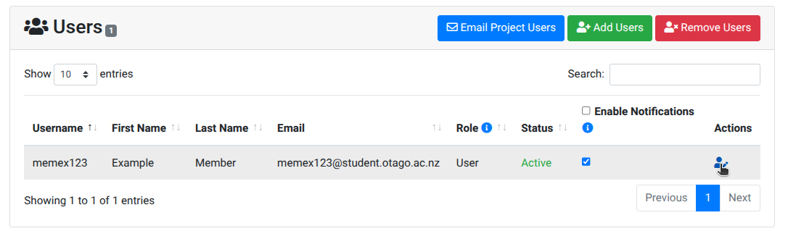

!!! warning

    Adding a user to a project does not automatically add them to allocations such as storage unless you chose to do so as part of the add stage. If you missed adding a user to an allocation or want to double check follow [Adding a new user to an existing allocation](#adding-a-user-for-an-existing-allocation)

 

### Editing a User Role

If you would like to reassign the role of a user, this is done clicking the person icon in the row with their name within the Users panel for the project.

 

Select the new role for the user, then click "Update"

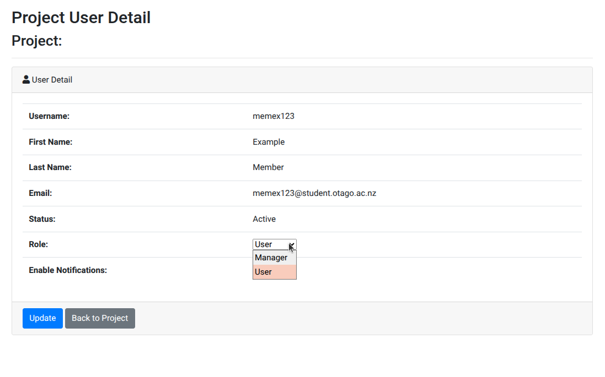

 
The new role should now be reflected in the Users panel for the project.

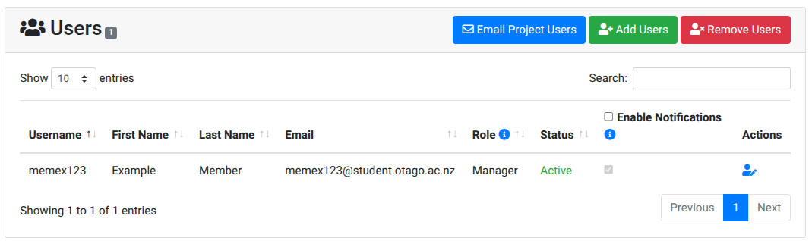

 

### Removing a User

PIs and users with the manager role can remove access to (non-PI) users on a project.

Find the Users panel for the Project and click "Remove Users"

 

Select the user(s) to be removed, and click "Remove Selected Users From Project".

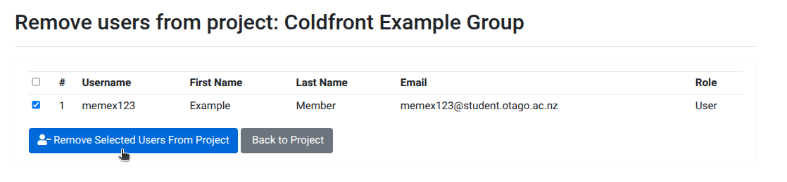

!!! Warning

    This will also remove users from **ALL** project allocations. If you want to remove a user from a specific allocation see [Adding or removing a user for an existing allocation](#removing-a-user-from-an-existing-allocation).

The project Users panel will now reflect the changes for the project.

### Managing Allocations

Allocations are resources that your project has access to such as project storage space, or a compute allocation on the cluster. See the [Coldfront Allocation Documentation](https://docs.coldfront.dev/en/stable-1.1.x/howto/allocations/) for more information about allocations.

PIs or users with the 'manager' role can request a new allocation for a project by clicking the "Request Resource Allocation" button on the Allocations panel. You will then be prompted to specify which resource you would like an allocation of, the reason for the allocation, and other required details. Once submitted the cluster admins will review and you will be notified of the decision about the request.

Allocations are not permanent and will have start and end date attributes which signify when a review of resourcing levels for the project will take place. 

#### View users on an allocation

To see the users that are listed on an allocation, find the "Allocations" panel on the project page and select the "folder" icon in the "Actions" column for the allocation you want to view.

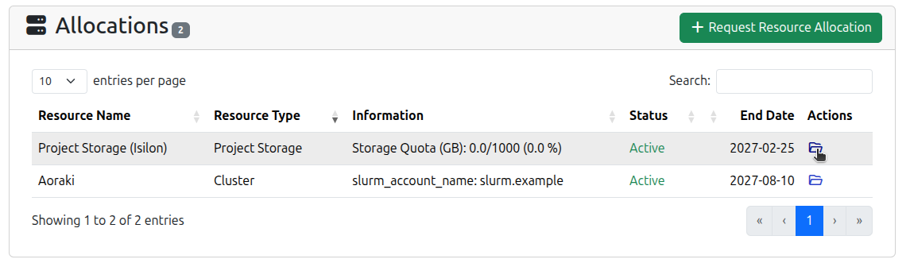

Users with access to the selected allocation will be listed in the User panel on the Allocation's page.

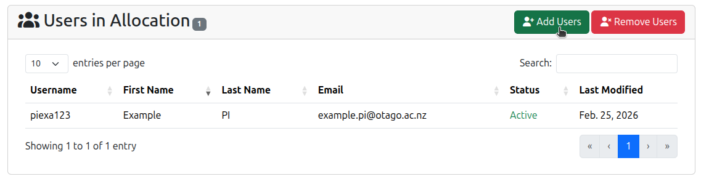

##### Adding a user for an existing allocation

Click "Add Users" and a list of possible users to add will appear.

!!! info
    Only users who have been added to the project and not to the allocation will be available to be added. If a user doesn't appear, ensure they have been added to the project.

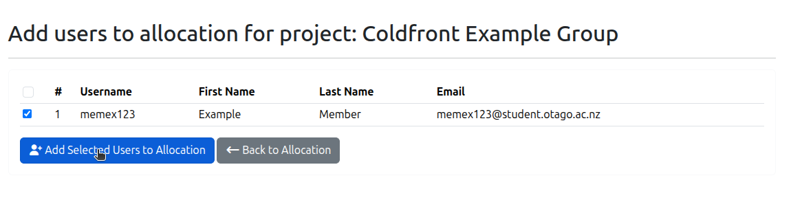

##### Removing a user from an existing allocation

View the allocation page, and then select "Remove Users" from the allocation users panel. Then select the desired users to remove and click "Remove Selected Users from Allocation".

#### Viewing Cluster Allocations

Information about the cluster allocations can be found on the Allocation panel on the project page in the information column. Further information can be found by selecting the allocation with the 'folder' icon in the actions column. The Allocation information panel will provide the slurm account code that has been assigned to the project which is to be used for running compute jobs on Aoraki/OnDemand.

#### Viewing Storage Allocations

Quotas for storage allocations are visible on the Allocation panel on the project page in the information column. Further information can be found by selecting the allocation with the 'folder' icon in the actions column. The Allocation information panel will list the path to the storage in the "description" field and the quota information can be found on the Allocation Attributes panel.

##### Applying for an Increased Quota

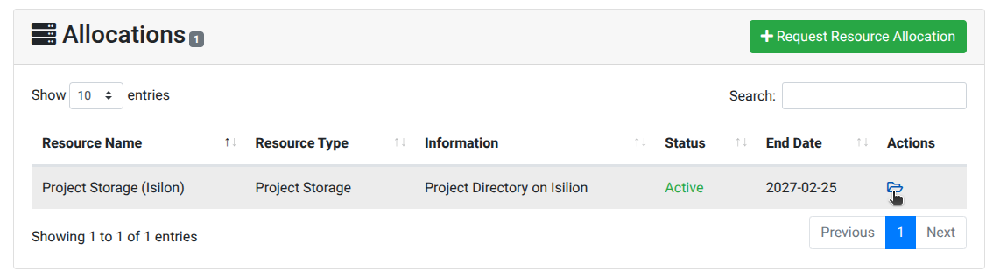

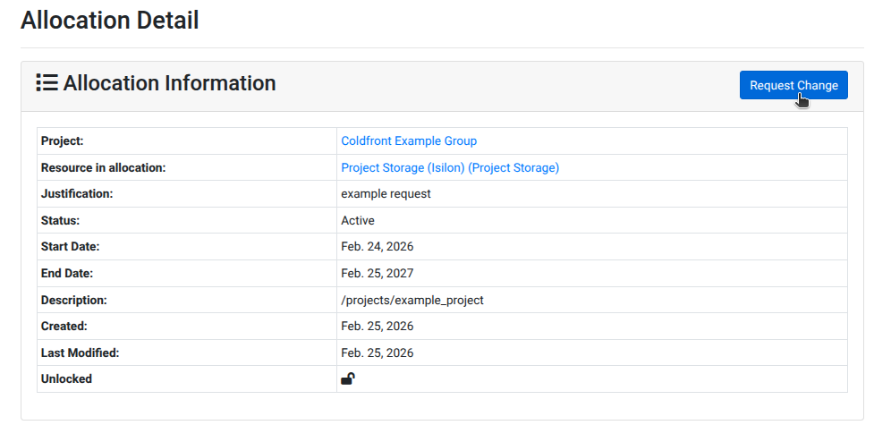

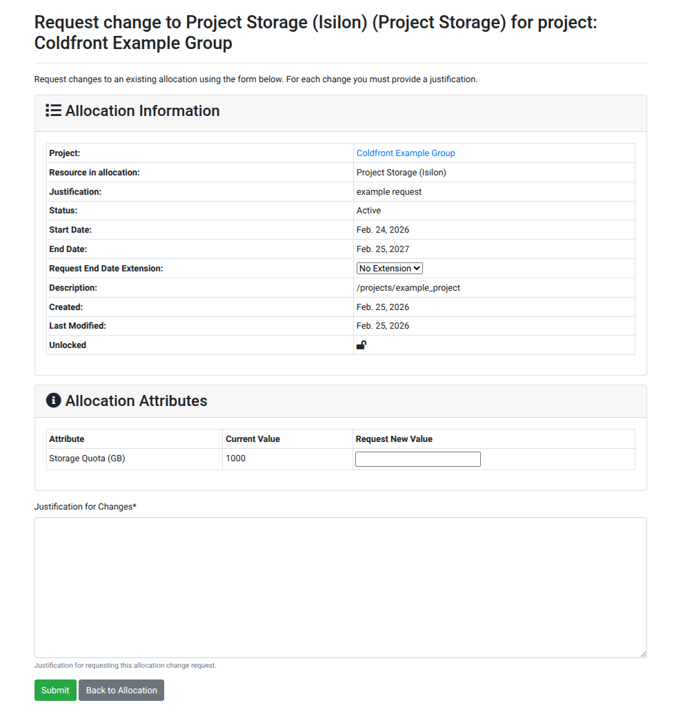

!!! info
    You may be contacted to discuss your data current and proposed usage before a decision is made on the quota change.

##### Applying for WEKA

On the Allocations panel within the Projects page, select "Request Resource Allocation" and then from the resource drop-down select "WEKA (Project Storage)" and in the justification provide details about why, how long, and size of quota being requested. Once submitted the cluster admins will review and you will be notified of the decision about the request.
