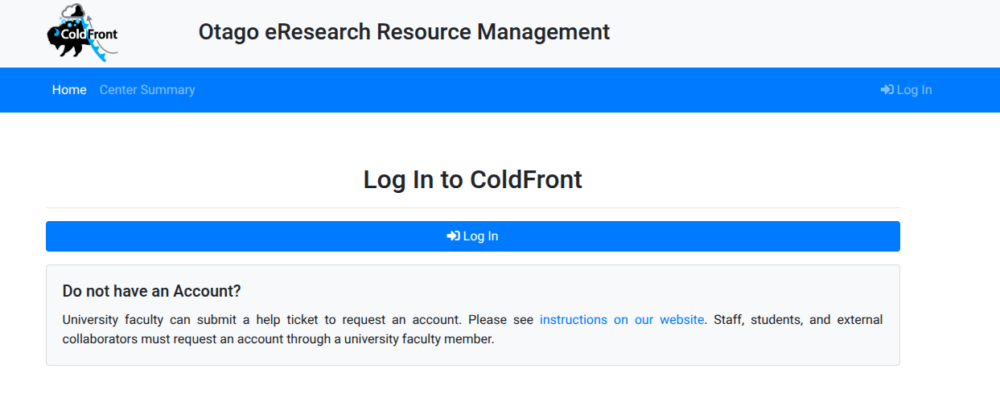
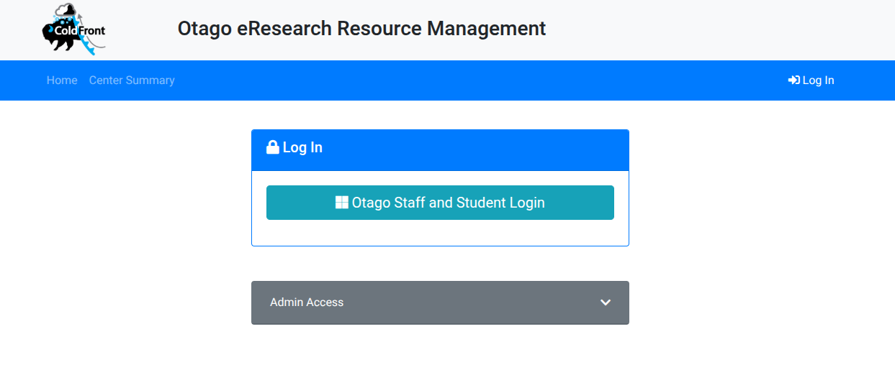
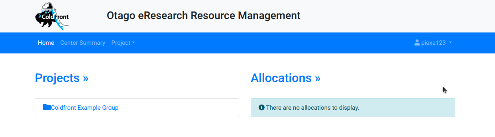
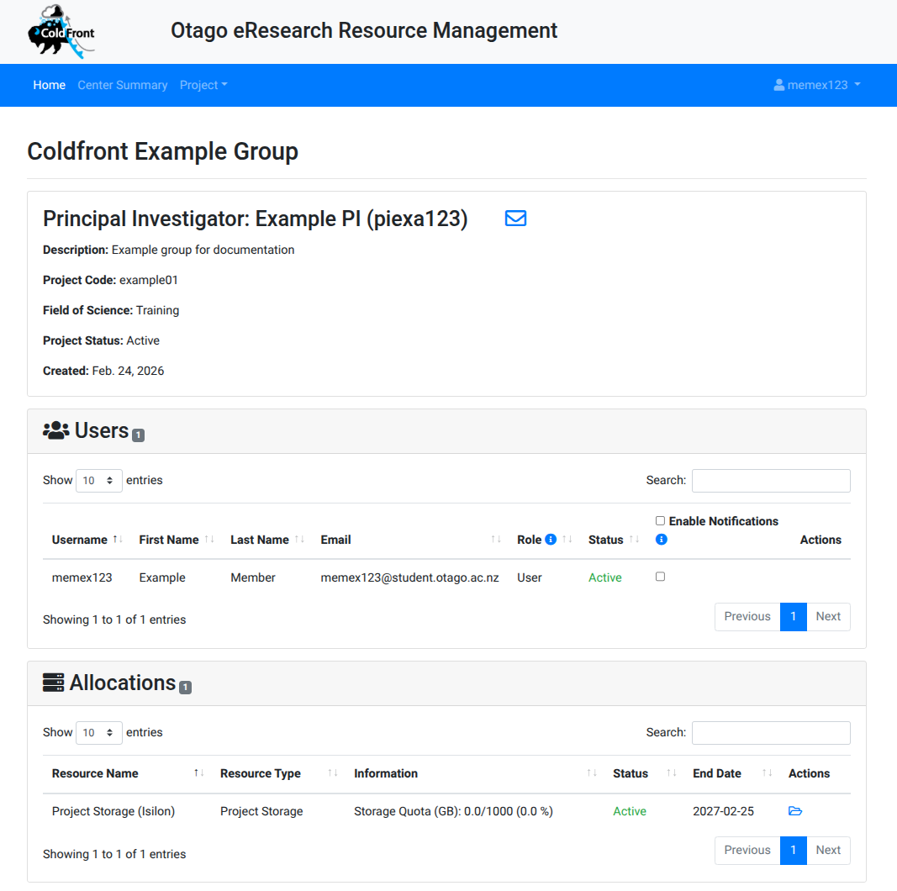
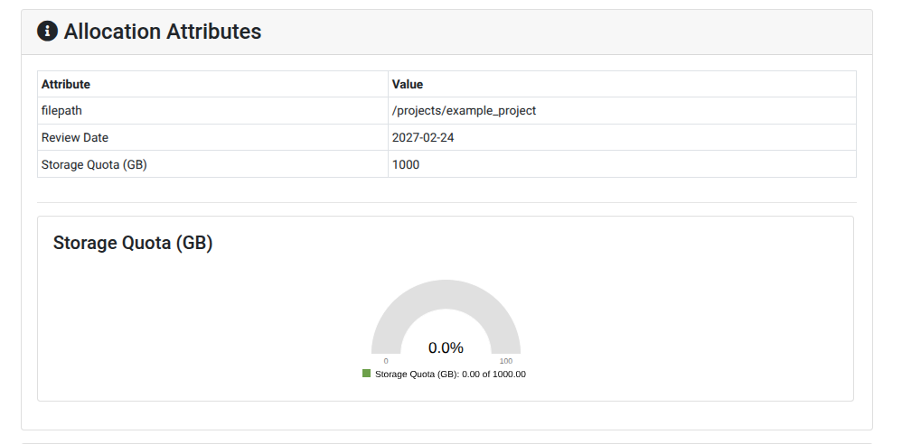

# Viewing Current Status

As a cluster user you can log into Coldfont ([https://coldfront.otago.ac.nz](https://coldfront.otago.ac.nz)) to see the status of your account and details of projects it is associated with.

!!! note
    Coldfront is accessible only from the campus network (or VPN)

## Logging in to Coldfront

Click the login button to proceed to the login page.

{width="800px"}

Use your University credentials to login.

{width="800px"}

## Viewing Projects

{width="800px"}

{width="800px"}

### Allocations and Quotas

{width="800px}

