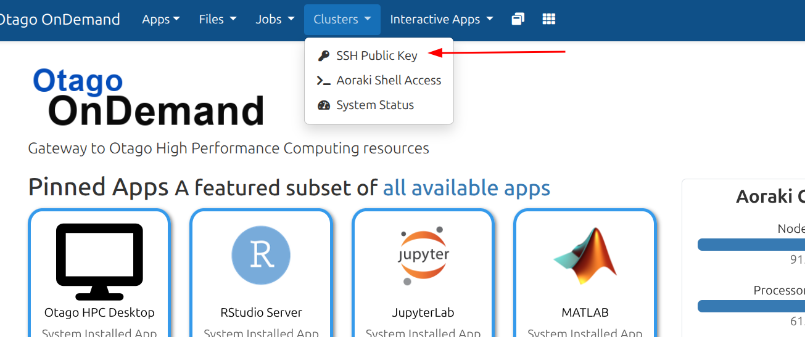
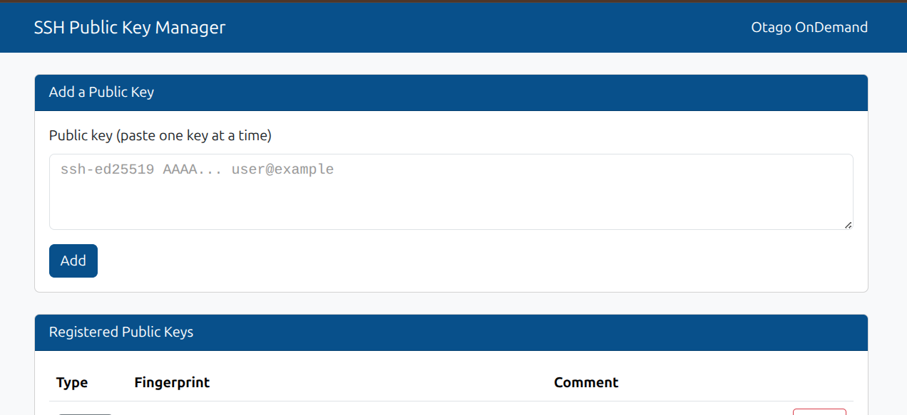
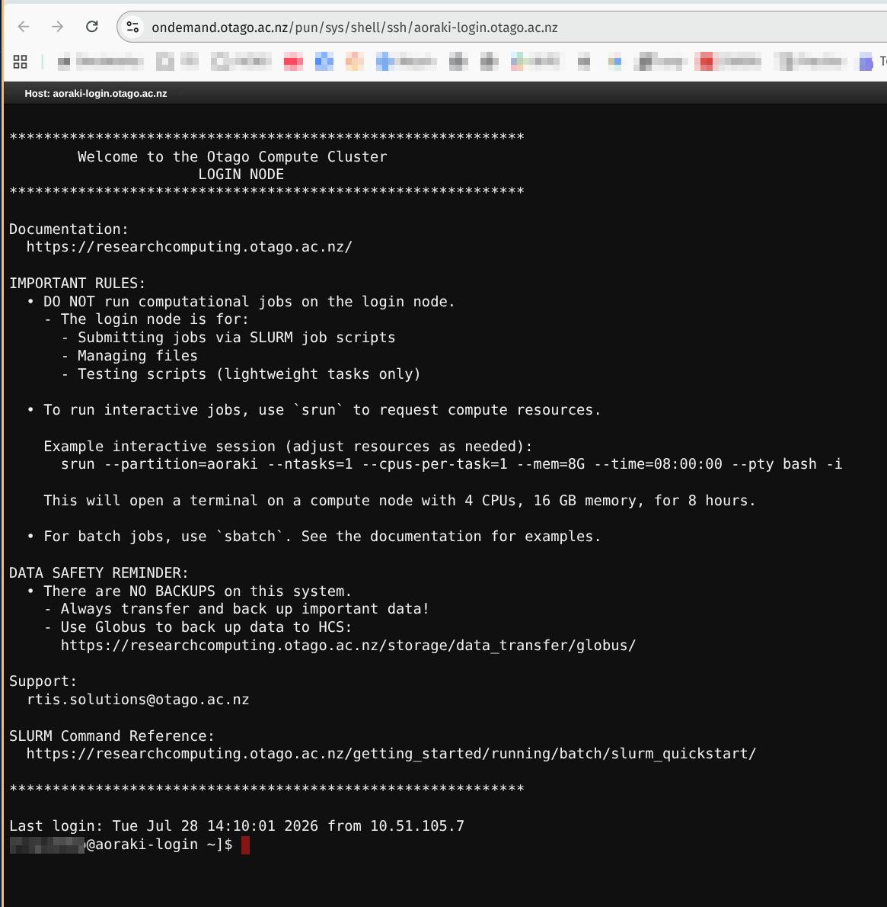

# SSH

!!! overview "On this Page"
    - How to generate an SSH key and register it with Otago OnDemand
    - How to SSH through a terminal
    - How to SSH with OnDemand


!!! warning
    You can access the Aoraki Cluster using SSH if you are on campus or connected to the campus VPN

## Setting up SSH key access

Register your SSH public key to enable key-based authentication to log in to the login node from a terminal. This is faster and required for some tools (e.g. `rsync`, `scp`, VS Code Remote-SSH) that don't handle interactive password prompts well.

### Step 1: Generate an SSH key pair

If you already have an SSH key pair (typically `~/.ssh/id_ed25519.pub` or `~/.ssh/id_rsa.pub` on Mac/Linux), you can skip to Step 2.

=== "Windows"

    Windows 10/11 ship with an OpenSSH client. Open **PowerShell** and run:

    ```powershell
    ssh-keygen -t ed25519 -C "your.name@otago.ac.nz"
    ```

    Press <kbd>Enter</kbd> to accept the default file location (`C:\Users\<you>\.ssh\id_ed25519`), then set (or skip) a passphrase.

    !!! info "Using PuTTY instead"
        If you use PuTTY rather than the built-in OpenSSH client, run **PuTTYgen**, click **Generate**, and save the private key. Copy the public key text shown in the box at the top of the window — you'll need it in [Step 2](#step-2-add-your-key-using-ssh-copy-id-or-otago-ondemand).

=== "macOS / Linux"

    Open a terminal and run:

    ```bash
    ssh-keygen -t ed25519 -C "your.name@otago.ac.nz"
    ```

    Press <kbd>Enter</kbd> to accept the default file location (`~/.ssh/id_ed25519`), then set (or skip) a passphrase.

!!! info "No ed25519 support?"
    If your system or client doesn't support `ed25519` keys, use `ssh-keygen -t rsa -b 4096` instead.


### Step 2: Add your key using ssh-copy-id or Otago OnDemand

=== "ssh-copy-id (macOS / Linux)"

    The quickest way to register your key is with `ssh-copy-id`. This copies your public key to the login node in a single command:

    ```bash
    ssh-copy-id -i ~/.ssh/id_ed25519.pub <otago-username>@aoraki-login.otago.ac.nz
    ```

    You will be prompted for your password once. After that, key-based login is ready — skip to Step 3.

=== "Otago OnDemand"

    1. [Log in to OnDemand](ondemand_web.md#sign-in) at [https://ondemand.otago.ac.nz](https://ondemand.otago.ac.nz).
    2. From the top navigation bar, select **Clusters > SSH Public Key**.

        {width="600px" align=left}

    3. On the **SSH Public Key Manager** page, paste your public key (the full line, e.g. `ssh-ed25519 AAAA... your.name@otago.ac.nz`) into the **Public key** box and click **Add**.

        {width="600px" align=left}

    4. Your key will now appear under **Registered Public Keys**.


### Step 3: Connect using your key

Once your key is registered, SSH to the login node as normal — if your private key is in the default location, no extra flags are needed:

```bash
ssh <otago-username>@aoraki-login.otago.ac.nz
```

You should connect without being prompted for your password. If you saved your key to a non-default location, specify it with `-i`:

```bash
ssh -i /path/to/your/private_key <otago-username>@aoraki-login.otago.ac.nz
```


!!! info "First time connecting"

    The first time you `ssh` from a computer you will likely see output extremely similar to:
    
    !!! terminal
        ```output
        The authenticity of host 'aoraki-login.otago.ac.nz (X.X.X.X)' can't be established.
        ED25519 key fingerprint is SHA256:WXAGQmlR5C7rvCOiSSL8PtiuxytA368rjozXXO0NckE.
        This key is not known by any other names.
        Are you sure you want to continue connecting (yes/no/[fingerprint])?
        ```

        !!! Warning

            Double check the fingerprint matches one of the following:
            ```
            (RSA) SHA256:pzUx1abRS35sbM9n/3OqMpGiF9zegvlG4jQrr78cGFg
            (ECDSA) SHA256:g/BKtsqcMchX7l7YRqDJ98azAumTxzQT0hCCCgVIKxc
            (ED25519) SHA256:WXAGQmlR5C7rvCOiSSL8PtiuxytA368rjozXXO0NckE
            ```

    Type 'yes' and <kbd>Enter</kbd>, where you will then be prompted for your password (or need to re-`ssh`) depending on your `ssh` client.


!!! warning "Password not showing"

    When typing in your password when prompted, nothing will be displayed on the screen. Once you have typed your password, press <kbd>Enter</kbd> to submit and continue. If you mistyped your password you will be prompted to re-enter it.

## SSH within OnDemand

To use the cluster shell access within OnDemand, first [connect to the **Otago OnDemand** web portal](ondemand_web.md#sign-in) and then from the top menu bar select the menu `Clusters` > `Aoraki Shell Access`.

You will then be prompted to input your password, similar to [SSH through the terminal](#step-3-connect-using-your-key).

{width="600px" align=left}


!!! related-pages "What's next?"
    Where to store your data and what your options are found on our [Storage Overview](../../storage/storage_options.md)

