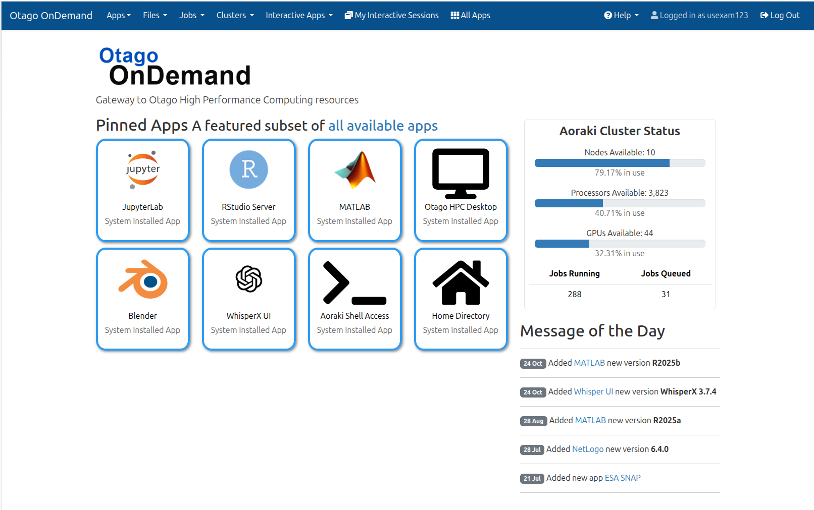

# Open OnDemand

## Overview

**Otago OnDemand (OOD)** is the gateway to Otago's High Performance Computing (HPC) resources. It provides a browser-based interface for launching interactive applications, running batch jobs, browsing files, and accessing a terminal without needing to install any software on your local machine.

OOD launches applications as [Slurm](https://slurm.schedmd.com/) jobs on your behalf. These are called **interactive sessions** and consume cluster resources in the same way as any other Slurm job, so the usual fair-use policies apply.

## Logging In

### Access the portal

Visit **[https://ondemand.otago.ac.nz](https://ondemand.otago.ac.nz)** in your web browser.

### Sign in

Log in using your **University of Otago email address and password**. If your account has multi-factor authentication (MFA) enabled, you will be prompted to complete the second factor before proceeding.

!!! note "Username format"
    Use your full university email address (e.g. `yourname@postgrad.otago.ac.nz` or `yourname@otago.ac.nz`), not just your username.

After a successful login, you will be taken to the OOD home page:

<figure markdown="span" style="display: block; margin-left: 0; margin-right: auto;">
  { width="600px" }
</figure>

---

## Available Applications

| Application | Description |
|---|---|
| **HPC Desktop** | A full graphical desktop environment running on the cluster |
| **RStudio** | Interactive R development environment |
| **Jupyter Notebook** | Browser-based Python (and other kernel) notebooks |
| **MATLAB** | Interactive MATLAB environment |
| **WhisperX** | Web UI for transcribing audio and video using OpenAI's Whisper AI models |

OOD also provides:

- **Slurm job scheduling** — submit and monitor batch jobs from the browser
- **File browser** — view, upload, download, and manage files on the cluster
- **Shell access** — open a terminal directly in your browser

---

## Launching an Interactive Session

1. From the top navigation bar, select **Interactive Apps**.
2. Choose an application (e.g. **RStudio**, **Jupyter Notebook**, or **HPC Desktop**).
3. Fill in the job parameters — number of CPUs, memory, wall time, and any application-specific options.
4. Click **Launch**. Your job will be queued with Slurm.
5. Once the job starts, a **Connect** button will appear. Click it to open the application in your browser.

!!! warning "Resource usage"
    Interactive sessions hold cluster resources for their entire duration, even when you are not actively using the application. Set a realistic wall time and end your session when you are finished to free resources for other users.

---

## File Management

The **Files** menu in the top navigation bar provides a graphical file browser for your home directory and any project or scratch storage you have access to. You can:

- Navigate directories
- Upload files from your local machine
- Download files to your local machine
- Create, rename, and delete files and directories

For large data transfers, command-line tools such as `scp`, `rsync`, or a dedicated transfer node are recommended over the browser interface.

---

## Shell Access

Select **Clusters > Otago HPC Shell Access** from the top navigation bar to open a terminal session in your browser. This gives you full command-line access to the cluster login node, equivalent to connecting via SSH.

---

## Submitting Batch Jobs

Select **Jobs > Job Composer** to create and submit Slurm batch scripts through the browser. The **Active Jobs** view lets you monitor the status of running and queued jobs.

For more complex workflows, you can write and submit batch scripts directly from the shell.

---

## Ending a Session

When you have finished with an interactive application:

1. Save your work within the application.
2. Return to the OOD dashboard.
3. Under **My Interactive Sessions**, find your running session and click **Delete**.

Simply closing the browser tab does **not** end the job — your allocation will continue running until the wall time expires or you explicitly delete it.

---

## Troubleshooting

**I can't reach the OOD portal.**
: Check that you are on the University network or connected via the [VPN](https://ask.otago.ac.nz/knowledgebase/article/KA-10002113).

**My session is stuck in "Queued" state.**
: The cluster may be busy. You can monitor queue status from the **Active Jobs** page. Consider requesting fewer resources or a shorter wall time to improve scheduling priority.

**My interactive session disconnected.**
: The job is likely still running. Return to the OOD dashboard and click **Connect** under **My Interactive Sessions** to reconnect.

**I'm getting an authentication error.**
: Ensure you are using your full university email address. If MFA is enabled on your account, complete the second-factor prompt when asked.

For further assistance, contact the [Research Computing team](mailto:hpc@otago.ac.nz) or log a ticket through the IT Service Desk.

---

!!! related-pages "What's next?"
    Find out where to store your data and what your options are on our [Storage Overview](../../storage/storage_options.md).