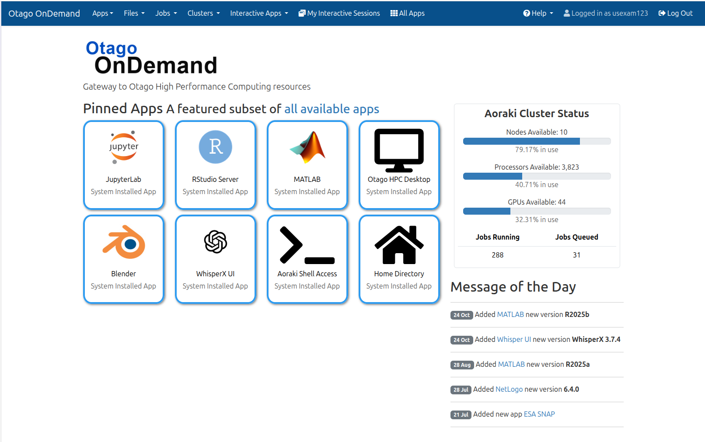

---
tags:
  - OnDemand
---

# Logging in to OnDemand (Web)

!!! overview "On this Page"
    - Where to find the OnDemand portal
    - How to sign in
    - What to do if you can't get in

**Open OnDemand** is the web gateway to the Research Cluster. It lets you launch interactive applications, submit jobs, browse files and open a terminal from your browser, with nothing to install on your own machine. This page covers getting logged in; for what the portal does once you are there, see the [Open OnDemand Overview](../software/OnDemand/ondemand.md).

## Before You Start

You need an account on the Research Cluster. If you do not have one, [fill in the access form](signup.md) or email the eResearch Support team at **{{ support_email }}**.

## Access the Portal

Visit **[https://ondemand.otago.ac.nz](https://ondemand.otago.ac.nz)** in your web browser.

!!! info "Legacy portal"
    A few applications are still hosted on the legacy instance at [https://ondemand-legacy.otago.ac.nz](https://ondemand-legacy.otago.ac.nz). You log in to it the same way. See [Available Apps](../software/OnDemand/available_apps.md) for which apps are where.

## Sign In

Log in using your **University of Otago email address and password**. If your account has multi-factor authentication (MFA) enabled, you will be prompted to complete the second factor before proceeding.

!!! note "Username format"
    Use your full university email address (e.g. `yourname@postgrad.otago.ac.nz` or `yourname@otago.ac.nz`), not just your username.

After a successful login, you will be taken to the OnDemand home page:

<figure markdown="span" style="display: block; margin-left: 0; margin-right: auto;">
  { width="600px" }
</figure>

## Troubleshooting

**I can't reach the OnDemand portal.**
: Check that you are on the University network or connected via the [VPN](https://ask.otago.ac.nz/knowledgebase/article/KA-10002113).

**I'm getting an authentication error.**
: Ensure you are using your full university email address. If MFA is enabled on your account, complete the second-factor prompt when asked.

**I can log in but I have no storage or my jobs won't start.**
: Your account may not have a cluster allocation yet. Email the eResearch Support team at **{{ support_email }}**.

**My session is stuck in "Queued" state.**
: The cluster may be busy. Monitor queue status from the **Jobs > Active Jobs** page, and consider requesting fewer resources or a shorter wall time.

**My interactive session disconnected.**
: The job is likely still running. Return to the dashboard and click **Connect** under **My Interactive Sessions** to reconnect.

For further assistance, contact the eResearch Support team at **{{ support_email }}** or log a ticket through the IT Service Desk.

!!! related-pages "What's next?"
    - For what you can do in the portal, see the [Open OnDemand Overview](../software/OnDemand/ondemand.md)
    - For the applications you can launch, see [Available Apps](../software/OnDemand/available_apps.md)
    - For the other way in to the cluster, see [Logging in with SSH](login_ssh.md)
    - For where to store your data, see the [Storage Overview](../../storage/storage_options.md)
