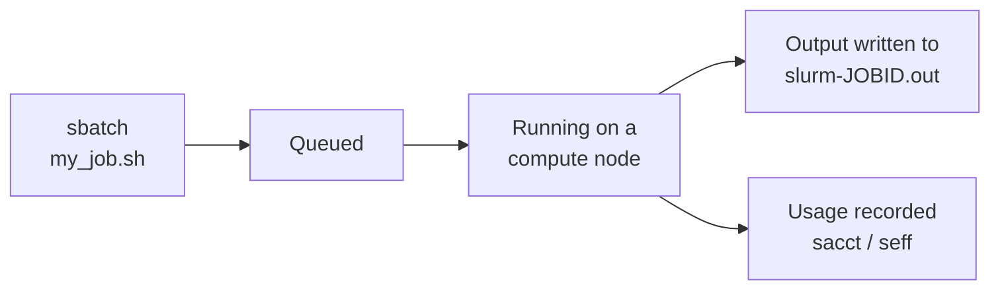

# Slurm Quickstart

!!! overview "On this Page"
    - What a batch job is and how one moves through the scheduler
    - Writing your first job script
    - Submitting it, finding the output, and cancelling it
    - Watching a job while it runs and checking it afterwards
    - Where to go for more complex job shapes

A **batch job** is a script that Slurm runs for you on a compute node, without you being there. You write down what you want run and what resources it needs, hand it to the scheduler, and collect the output when it finishes.

This page takes you from nothing to a completed job. For the meaning of every option you can put in a script, see [Job Script Options](sbatch_options.md).

!!! tip "Not sure batch is what you want?"
    If you need to see results as you go, click on things, or work out what your analysis should do, start with an [interactive session](../interactive/interactive.md) instead.

## How a Job Moves Through Slurm



You submit with `sbatch`. Slurm gives you a job ID and puts the job in the queue. When a node with the resources you asked for is free, the job starts, your script runs top to bottom, and anything it prints goes to a file. When the script exits — or when it hits the wall time or memory limit — the job ends and the resources are released.

The whole thing is unattended. You can log out, and the job keeps going.

## Your First Job Script

A job script is an ordinary bash script with `#SBATCH` lines at the top. Those lines look like comments to bash but are read by Slurm as your resource request.

Save this as `my_job.sh`:

!!! terminal

    ```bash
    #!/bin/bash
    #SBATCH --job-name=hello          # a name you will recognise in squeue
    #SBATCH --partition=aoraki        # which group of nodes to run on
    #SBATCH --cpus-per-task=1         # cores
    #SBATCH --mem=2G                  # memory for the whole job
    #SBATCH --time=00:05:00           # wall time limit (hh:mm:ss)

    # Everything below here is ordinary bash, run on the compute node.
    echo "Running on $(hostname)"
    echo "Started at $(date)"

    sleep 30                          # stand-in for your actual work

    echo "Finished at $(date)"
    ```

Three rules cover almost everything:

- **`#SBATCH` lines must come before any command.** Slurm stops reading them at the first real line of the script.
- **Your script starts in the directory you submitted it from**, not in your home directory. Use absolute paths, or `cd` at the top, if that matters.
- **Anything you would type in a shell works**, including `module load`. See [Modules](../../software/software_environments/modules.md).

!!! note "You do not need `--account` unless you have more than one account (some users belong to more than one lab group and wish to separate job accounting)"
    On Aoraki every user has a default account and every partition accepts it. Scripts copied from other clusters' documentation often carry an `#SBATCH --account=` line — delete it.

## Submitting It

!!! terminal

    ```bash
    sbatch my_job.sh
    ```

    ```output
    Submitted batch job 716
    ```

`716` is the **job ID**. Note it down — it is how you refer to the job in every other command, and it is in the name of the output file.

You can override anything in the script from the command line, which is handy for a one-off change without editing the file. Command-line options win:

!!! terminal

    ```bash
    sbatch --time=00:30:00 --job-name=longer_run my_job.sh
    ```

### Finding the Output

Anything your script prints — both normal output and errors — goes to `slurm-<jobid>.out` in the directory you submitted from:

!!! terminal

    ```bash
    cat slurm-716.out
    ```

    ```output
    Running on aoraki07
    Started at Wed  5 Aug 09:14:02 NZST 2026
    Finished at Wed  5 Aug 09:14:32 NZST 2026
    ```

To send them somewhere else, or to separate normal output from errors, use `--output` and `--error` — see [Output and Errors](sbatch_options.md#output-and-errors).

## Watching and Stopping a Job

Four commands cover day-to-day use.

Table: The commands you need while a job is in the system

| Command | What it tells you |
| :-- | :-- |
| `squeue --me` | Your queued and running jobs, and which node each is on |
| `scancel <jobid>` | Cancels a job. You can only cancel your own |
| `sacct -j <jobid>` | What happened to a job after it finished, including why it failed |
| `seff <jobid>` | How much of what you asked for the job actually used |

!!! terminal

    ```bash
    squeue --me
    ```

    ```output
    JOBID PARTITION     NAME     USER ST       TIME  NODES NODELIST(REASON)
      716    aoraki    hello  user123  R       0:12      1 aoraki07
      717    aoraki  bigjob   user123 PD       0:00      1 (Resources)
    ```

`ST` is the state: `R` is running, `PD` is pending. For a pending job, the bracketed text is *why* it has not started — `(Resources)` means it is waiting for a node to free up, `(Priority)` means other jobs are ahead of it.

To stop a job, whether it is queued or running:

!!! terminal

    ```bash
    scancel 716
    scancel --me      # cancel everything you have submitted
    ```

Once the job has ended, `sacct` shows how it finished:

!!! terminal

    ```bash
    sacct -j 716 --format=JobID,JobName,Partition,State,Elapsed,MaxRSS,ExitCode
    ```

A state of `COMPLETED` means the script exited cleanly. `FAILED`, `OUT_OF_MEMORY` and `TIMEOUT` each point at a different fix — see [Why Did My Job Fail?](../../../general/faq/slurm_job_failures.md).

!!! tip "Check what it actually used"
    `seff 716` compares what you asked for against what the job used. It is the fastest way to find out that your job needed 4 GB rather than the 64 GB you reserved. See [Job Efficiency](../efficiency.md).

## Asking for the Right Resources

Your request is a hard limit: exceed the memory or the wall time and the job is killed. But asking for far more than you need makes the job wait longer, because Slurm has to find a bigger gap, and it keeps resources reserved that nobody else can use.

The practical approach is to run a small version first, look at `seff`, and size the real job from that.

Two things to keep in mind while you do:

- **The defaults are modest.** Without `--mem` you get 2 GB per core; without `--time` you get the partition's default, usually 8 hours. See [What you get by default](../running_jobs_overview.md#what-you-get-by-default).
- **A shorter wall time genuinely starts sooner.** Slurm backfills short jobs into gaps in the schedule, so `--time=01:00:00` finds many more opportunities than `--time=3-00:00:00`.

Which partition to use, and the per-job limits that apply to each, are in the [Cluster Overview](../../../getting_started/overview.md). [Current Utilisation](../../current_utilisation.md) shows what is busy right now.

[All the options in detail :material-arrow-right:](sbatch_options.md){ .md-button }

## Common Job Shapes

Once a single job works, most real workloads are one of a handful of patterns:

Table: Where to find each kind of job script

| You want to | See |
| :-- | :-- |
| Run the same script over many inputs | [Array Jobs](slurm_examples/array-slurm.md) |
| Use a GPU | [GPU Jobs](slurm_examples/gpu-slurm.md) |
| Run one job only after another succeeds | [Dependent Jobs](slurm_examples/dependent_jobs.md) |
| Run R code | [R Jobs](slurm_examples/r-slurm.md) |
| Run Python code | [Python Jobs](slurm_examples/python-slurm.md) |
| Give different parts of one job different resources | [Heterogeneous Jobs](slurm_examples/heterogeneous_jobs.md) |

!!! warning "Submitting many jobs at once"
    Array jobs are the right way to run hundreds of similar tasks — not a loop that calls `sbatch` hundreds of times. See [Reasonable Usage](../../../general/guidelines/reasonable_usage.md) for the limits that apply.

!!! related-pages "What's next?"
    - For every `#SBATCH` option and its Aoraki default, see [Job Script Options](sbatch_options.md)
    - To check whether your request matched what you used, see [Job Efficiency](../efficiency.md)
    - For worked examples, see [Example Job Scripts](slurm_examples/array-slurm.md)
    - If a job failed or will not start, see [Why Did My Job Fail?](../../../general/faq/slurm_job_failures.md) and [Why Is My Job Not Starting?](../../../general/faq/job_start_time.md)
    - For partitions, hardware and limits, see the [Cluster Overview](../../../getting_started/overview.md)
    - The complete Slurm reference is at [slurm.schedmd.com](https://slurm.schedmd.com/documentation.html)
