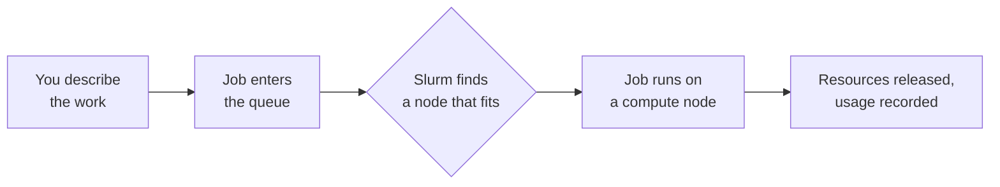
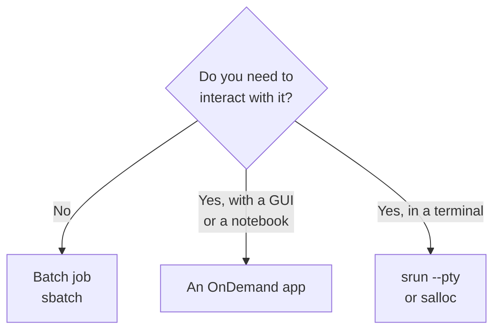

# Running Jobs

!!! overview "On this Page"
    - Why the cluster uses a scheduler, and what that means for you
    - What a job gets if you do not ask for anything in particular
    - Why asking for less usually starts sooner
    - Whether your work belongs in an interactive session or a batch job

You do not run work on the Research Cluster by logging in and starting it. You *describe* the work — how many cores, how much memory, how long, whether you need a GPU — and [Slurm](https://slurm.schedmd.com/documentation.html), the scheduler, decides which node runs it and when.

That description is a **job**. Everything that runs on a compute node is a job, including the OnDemand apps that write the job for you.

## Why There Is a Scheduler

The cluster is shared. Without a scheduler, two people would land on the same node, compete for the same cores and memory, and both jobs would run badly.

Two consequences are worth understanding early, because they explain most of what the rest of these pages tell you to do.

**Nodes are shared, and memory is a resource like cores.** Slurm allocates cores *and* memory, so one node can be running several jobs at once. If you request 200 GB and use 8 GB, the remaining 192 GB is reserved for you and unavailable to anyone else — even though nothing is using it. Over-requesting memory idles cores that nobody can reach.

**Your request is both a promise and a limit.** Your job cannot use more than it asked for: exceed the memory and it is killed, exceed the wall time and it is killed. Under-request and the job dies; over-request and it waits longer and blocks others. [Job Efficiency](efficiency.md) is how you find the right number.

## What You Get by Default

You do not have to specify everything. Every job inherits defaults, and for a small test job the defaults are often enough.

Table: What a job gets on Aoraki when you do not ask for something specific

| If you do not set… | You get | Notes |
| :-- | :-- | :-- |
| `--partition` | `aoraki` | 27 general-purpose nodes. See [Partitions](../overview.md#partitions). |
| `--time` | The partition's default: **8 hours** on most, 1 hour on `aoraki_short`, 24 hours on `aoraki_long` | Your job is killed at the limit, so set this deliberately. |
| `--mem` or `--mem-per-cpu` | **2 GB per allocated CPU** | A 4-core job gets 8 GB unless you say otherwise. |
| `--cpus-per-task` | 1 core | |
| `--nodes` | 1 node | |
| `--account` | Your default account | You do not need to set this on Aoraki. |

!!! note "You do not need `--account`"
    Some HPC sites require every job to name an account to charge. Aoraki does not — you have a default account and every partition accepts it. If you see `--account=` in a script copied from another cluster's documentation, you can delete the line.

### Why Asking for Less Starts Sooner

Slurm runs a **backfill** scheduler. While it holds nodes free for a large job at the front of the queue, it looks further down the queue for smaller jobs that can start *and finish* in the gap before the large job is due to begin. A short job that fits the gap is started immediately, ahead of its turn.

So a realistic `--time` is not just good manners — it is the single most effective thing you can do to start sooner. A job asking for 1 hour has far more gaps to fit into than the same job asking for 3 days.

Priority also uses **fairshare**, so a group that has recently used a large share of the cluster is scheduled behind one that has not.

!!! tip "Before you submit"
    [Current Utilisation](../current_utilisation.md) shows what is busy right now. If the partition you want is full, a smaller request or a quieter partition may start much sooner. If your job is already queued and you want to know why, see [Why Is My Job Not Starting?](../../general/faq/job_start_time.md)

## Interactive or Batch?

There are two ways to run work, and the difference is simply whether you are there while it runs.

| | Interactive | Batch |
| :-- | :-- | :-- |
| **You are** | at the keyboard while it runs | free to log out |
| **Best for** | exploring data, debugging, graphical software, working out what resources you need | production runs, long jobs, anything repeated |
| **Started with** | an [OnDemand app](../software/OnDemand/available_apps.md), `srun --pty` or `salloc` | `sbatch` |
| **Resources** | held for the whole session, whether or not you are typing | held only while the work runs |
| **Watch out for** | wasting an allocation while you think, and losing the session if your connection drops | needing the script to be right before it starts |

A common and sensible pattern is to use both: work out the shape of your analysis interactively on a small slice of the data, then turn it into a batch script and submit it over the whole dataset.

!!! warning "Neither one means the login node"
    Neither route means running your analysis where you land when you log in. The login node is shared by everyone and is for editing scripts, moving files and submitting work. See [Login Node Usage](../../general/guidelines/login_node_usage.md).

!!! related-pages "What's next?"
    - To work interactively, see [Interactive Jobs](interactive/interactive.md)
    - To submit your first batch job, see the [Slurm Quickstart](batch/slurm_quickstart.md)
    - For the full list of `#SBATCH` options and their Aoraki defaults, see [Job Script Options](batch/sbatch_options.md)
    - To check whether you asked for the right amount, see [Job Efficiency](efficiency.md)
    - For the partitions, hardware and limits, see the [Cluster Overview](../overview.md)
