---
tags:
  - OnDemand
---

# OnDemand HPC Desktop

!!! overview "On this Page"
    - What the HPC Desktop is for, and when to use something else
    - Key information when launching HPC Desktop
    - What the 2 different types of Desktops look like
    - Features available on each Desktop
    - Features available on both Desktops
    - How to work with your files from the desktop

The HPC Desktop is an [Open OnDemand](ondemand.md) interactive app that gives you a full Linux desktop running on a compute node, for graphical software that has no dedicated OnDemand app of its own.

Like every OnDemand interactive app, the desktop runs as a Slurm job — the resources you pick on the launch form are the job's resource request, and the session holds them until you delete it or the wall time runs out.

!!! note "Use a dedicated app where one exists"
    If the software you need has its own OnDemand app — JupyterLab, RStudio, MATLAB and so on — launch that instead. Those apps come configured for the job and are simpler to start. See [Available Apps](available_apps.md). Where your work can be done from the command line, a [batch job](../../running/batch/slurm_quickstart.md) is a better use of cluster resources than a desktop session.

## Before You Start

You need access to the Research Cluster. If you do not have it yet, [fill in the access form](../../access/signup.md) or email the eResearch Support team at **{{ support_email }}**.

Log in to [https://ondemand.otago.ac.nz](https://ondemand.otago.ac.nz) and choose **Otago HPC Desktop** from the **Interactive Apps** menu.

## Launching HPC Desktop

When launching the desktop you can customise the computational components to suit your needs by clicking Advanced options. You can choose between 2 desktop environments XFCE and GNOME. If you have GPU intensive tasks select the "Request GPU" button.

When adjusting other components like cores and memory please refer to the guidelines <!--FIXME make a guidelines page or see if Nesi ones apply https://docs.nesi.org.nz/Getting_Started/Next_Steps/Finding_Job_Efficiency/ https://docs.nesi.org.nz/Getting_Started/Next_Steps/Job_Scaling_Ascertaining_job_dimensions/#initial-python-script https://docs.nesi.org.nz/Getting_Started/Next_Steps/MPI_Scaling_Example/--> or compare the job you want to run to previous jobs you have run.


{width="400px" .left}

Fill out the form and press **Launch**. Your session is queued with Slurm and starts once the resources you asked for are free — asking for less usually means starting sooner.

Once the session starts you can set the image compression and quality before connecting. Increasing compression will increase input lag but is better for low bandwidth connections. For image quality you want to decrease if you have a low bandwidth. If you are unhappy with the defaults you can relaunch the session from this page with different choices.

{width="600px" .left}

Then press **Launch Desktop** and the desktop opens in a new tab.

!!! tip "Ending your session"
    Closing the browser tab does not end the job. Return to **My Interactive Sessions** on the OnDemand dashboard and click **Delete** to release the resources.

## HPC Desktop Overview

This is what the HPC Desktop Overviews look like there are 2 versions XFCE and GNOME.

{width="600px" .left}

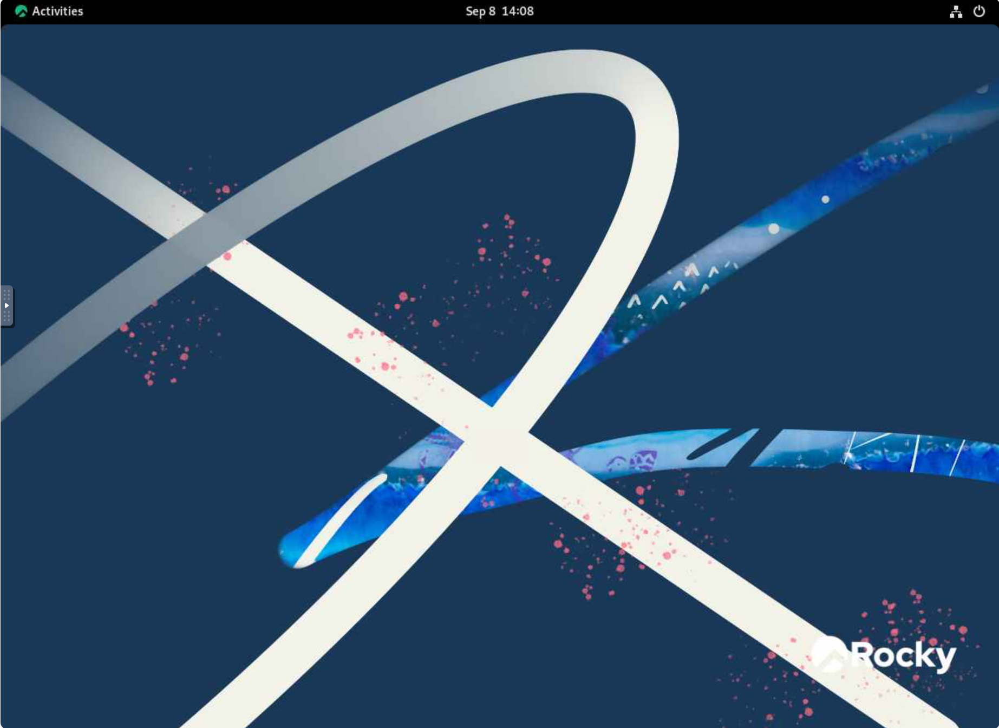{width="600px" .left}

## Both Desktops - Sidebar

The arrow to the left of the desktop opens the side bar.

{width="100px" .left}

### Extra Buttons

The Extra Buttons allow you to 'hold' down one or multiple buttons while using the desktop.

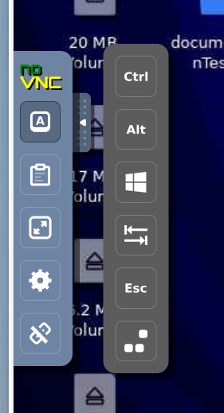{width="200px" .left}

### Clipboard

Clipboard allows you to see what you last copied.

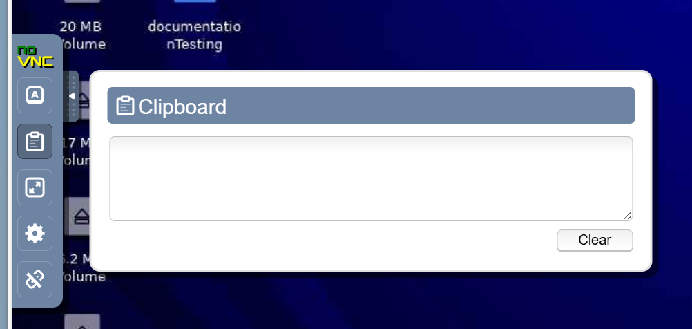{width="600px" .left}

### Fullscreen

Puts the HPC Desktop into fullscreen mode.

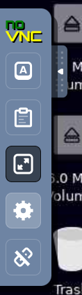{width="100px" .left}

### Settings

Settings allows you to adjust settings for connecting to the HPC Desktop. 

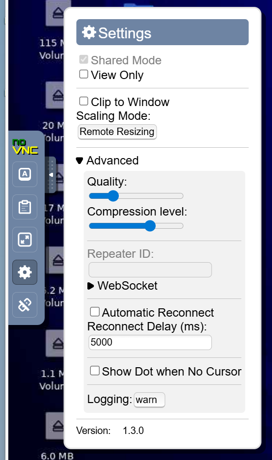{width="200px" .left}

### Disconnect

Disconnects you from the HPC Desktop, you may need to relaunch the Desktop from Open OnDemand if you click this option.

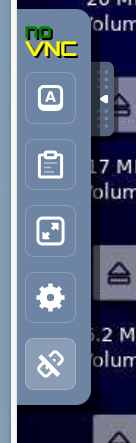{width="100px" .left}

## HPC Desktop Features

=== "XFCE Desktop"
    ### Taskbar
    Where you can switch between open application i.e. Firefox and Terminal. The grey boxes on the left allow you to switch between desktops.

    {width="700px" .left}

    The applications button on the left opens to access different applications and settings available on the HPC Desktop.
    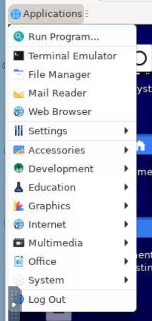{width="200px" .left}

    ### Terminal

    The terminal is used to run commands for various tasks. For example transferring data on to and from the cluster using [scp or rsync](../../../storage/data_transfer/rsync.md).

    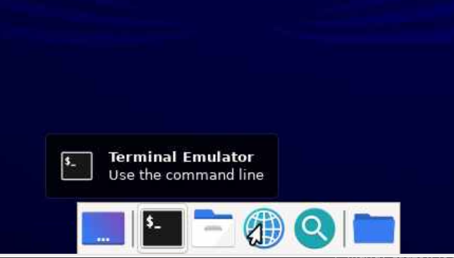{width="600px" .left}

    ### File Manager

    File manager allows you to see what files are stored on the HPC Desktop and interact with them for example copying, pasting or renaming.

    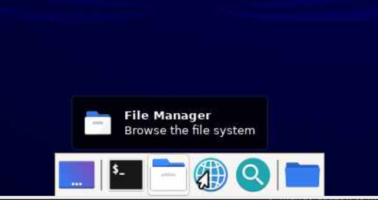{width="600px" .left}

    ### Web Browser

    Web browser is a way to access the internet and search the web from the HPC Desktop.

    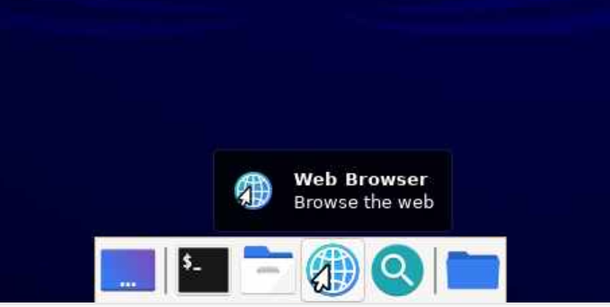{width="600px" .left}

    ### Application Finder

    Application Finder helps you search applications available on your HPC Desktop.

    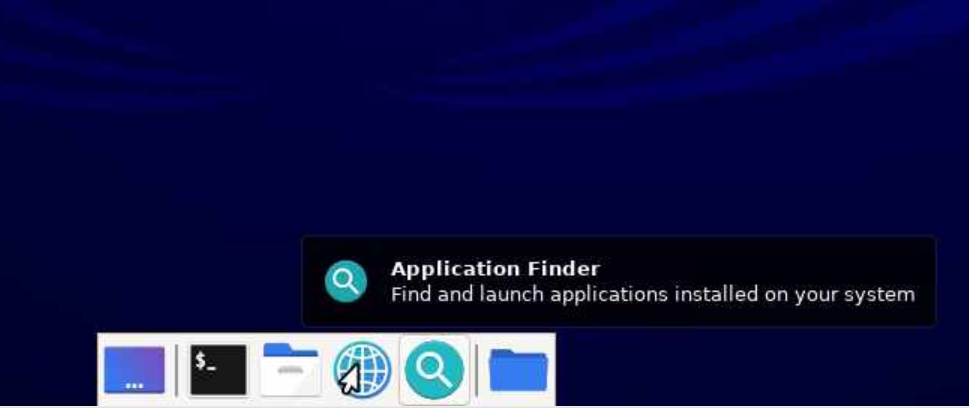{width="600px" .left}


=== "GNOME Desktop"

    ### Toolbar to Taskview
    To access the toolbar click the activities button in the top left corner.
    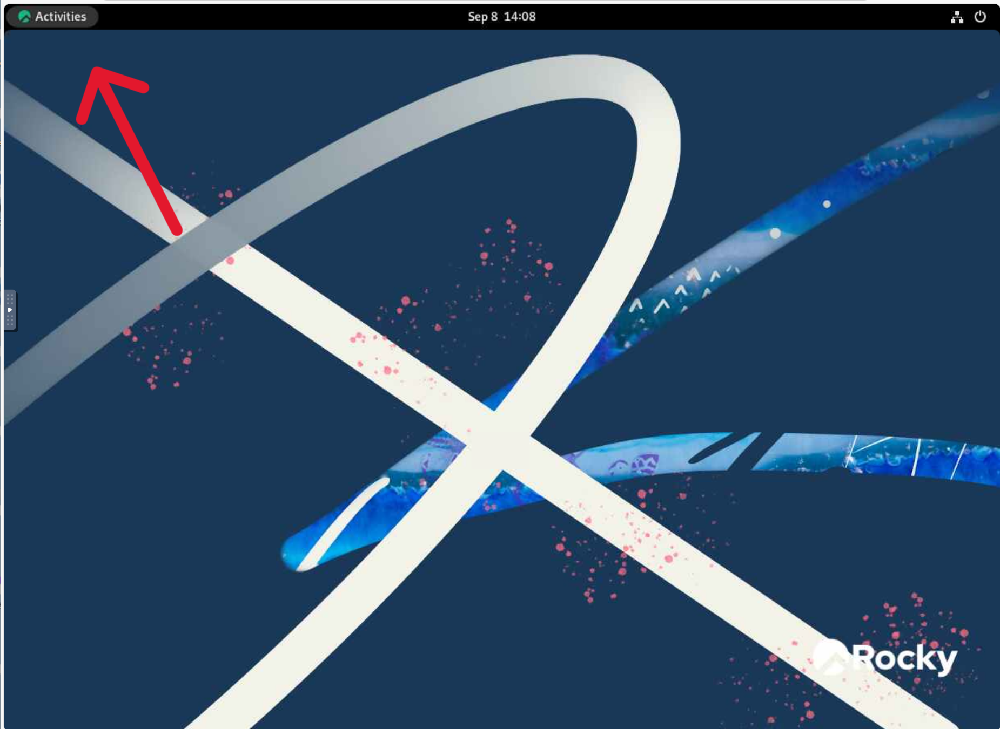{width="600px" .left}

    That will open the below screen where you can manage your desktops and access your toolbar.
    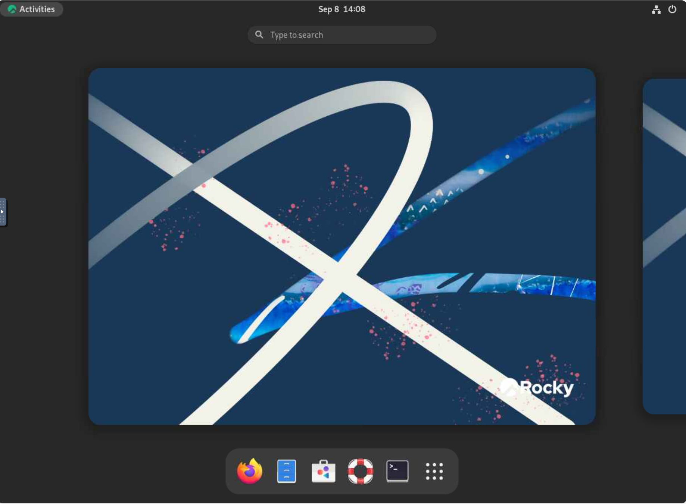{width="600px" .left}

    ### Web Browser - Firefox

    Firefox is the web browser available on GNOME.
    Web browser is a way to access the internet and search the web from the HPC Desktop.

    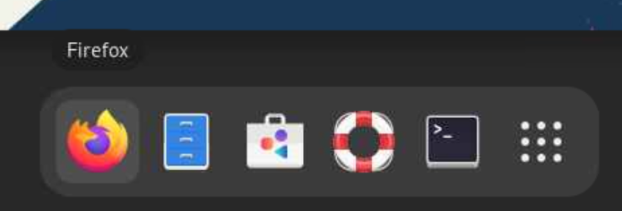{width="600px" .left}

    ### File Manager

    Files is the file manager on GNOME that allows you to see what files are stored on the HPC Desktop and interact with them for example copying, pasting or renaming.

    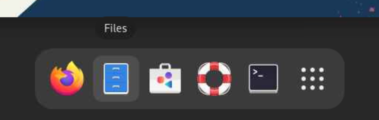{width="600px" .left}

    ### Software
    
    Software allows you to see what software is installed, can be installed and needs updating.

    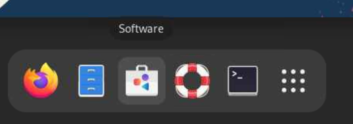{width="600px" .left}
    
    ### Help
    
    Documentation to help you find and use features of the GNOME desktop.

    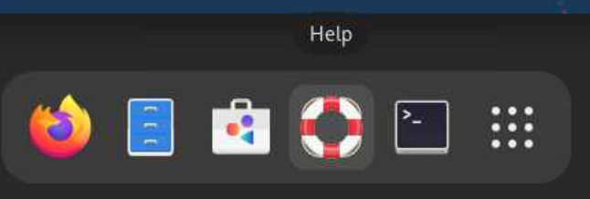{width="600px" .left}

    ### Terminal

    The terminal is used to run commands for various tasks. For example transferring data on to and from the cluster using [scp or rsync](../../../storage/data_transfer/rsync.md).

    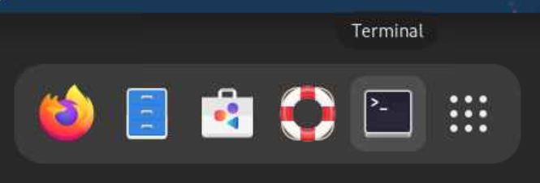{width="600px" .left}

    ### Show Applications

    Show Applications displays the applications on the Desktop i.e. calculator or application finder.

    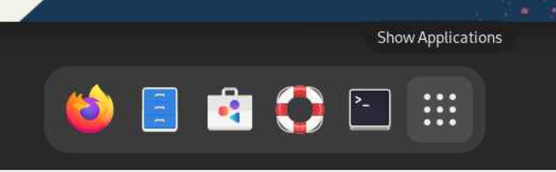{width="600px" .left}


## Working With Your Files

Your desktop session runs directly on the Research Cluster, so it sees the same storage as any other cluster session — your [home directory](../../../storage/data_locations/homes.md), your [projects directory](../../../storage/data_locations/projects.md), and [Weka](../../../storage/data_locations/weka.md). You can work with them through the desktop's file manager or from a terminal.

To open a terminal, right click anywhere on the desktop and select **Open Terminal Here**.

### Using Otago HCS data

[Otago HCS](../../../storage/data_locations/hcs.md) is the recommended long-term home for your research data, but it is not suited to being read from and written to during computation — the connection is not built for cluster speeds. The workflow is to stage your data in, process it, and copy the results back:

1. Copy your data from your HCS share to your projects directory.
2. Process it on the cluster.
3. Copy your results back to your HCS share.

!!! warning
    Connecting to HCS from the cluster is for **moving data**, not for processing it in place.

To reach your HCS share from a terminal in the desktop session:

1. Note your HCS share name — the part after `//storage.hcs-p01.otago.ac.nz/`.
2. Run `kdestroy` to clear any stale Kerberos tickets.
3. Run `kinit` and enter your University password. The terminal shows no feedback as you type; press Enter to confirm.
4. Navigate to `/mnt/auto-hcs/<yourshare>`.
5. Copy what you need across to your projects directory, for example:

!!! terminal

    ```bash
    rsync -avz /mnt/auto-hcs/its-rtis/testfile /projects/rtis/higje06p/
    ```

You can also do this through the desktop's file manager:

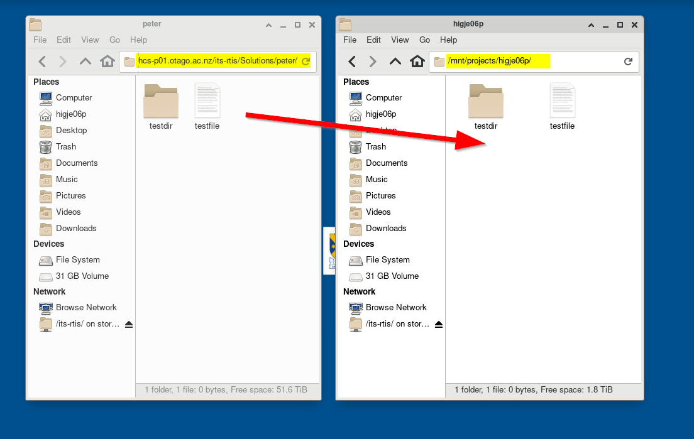{width="600px" .left}

When you have finished processing, copy your results back to your HCS share.

This is the small-transfer route. For anything large, or if you need HCS access from a compute node during a job, see [Otago HCS](../../../storage/data_locations/hcs.md) and [Data Transfer](../../../storage/data_transfer/data_transfer_overview.md).

!!! related-pages "What's next?"
      - For more information about OnDemand see the [Open OnDemand Overview](ondemand.md)
      - For managing files in the browser instead, see the [OnDemand File Manager](ood_file_manager.md)
      - For the other apps you can launch, see [Available Apps](available_apps.md)
      - Looking for something else? See the [Software Overview](../index.md)
      - For how to run a job on the cluster go to [Running Jobs](../../running/running_jobs_overview.md)
