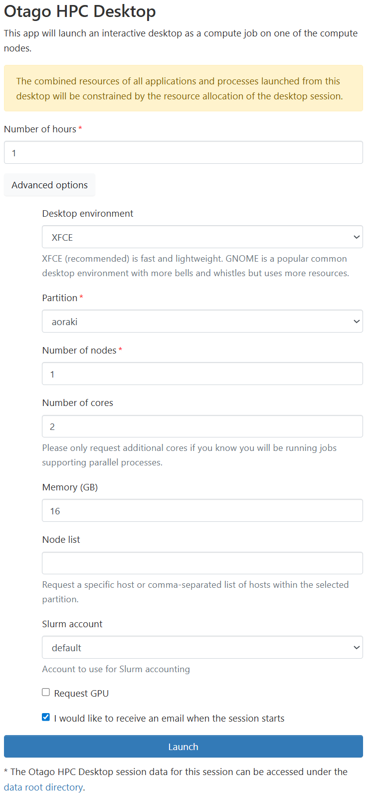
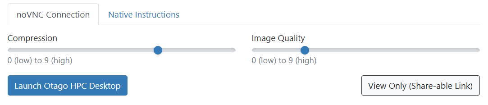
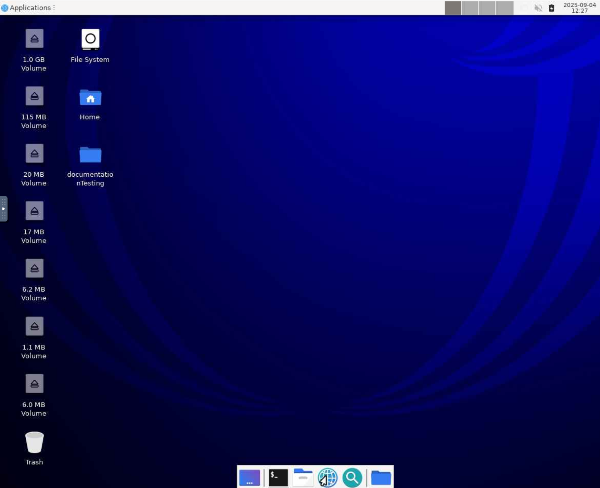

---
tags:
  - OnDemand
---

# OnDemand HPC Desktop

!!! overview "On this Page"
    - What the HPC Desktop is for, and when to use something else
    - Key information when launching HPC Desktop
    - What you get once the desktop opens
    - How to work with your files from the desktop

The HPC Desktop is an [Open OnDemand](ondemand.md) interactive app that gives you a full Linux desktop running on a compute node, for graphical software that has no dedicated OnDemand app of its own.

Like every OnDemand interactive app, the desktop runs as a Slurm job — the resources you pick on the launch form are the job's resource request, and the session holds them until you delete it or the wall time runs out.

!!! note "Use a dedicated app where one exists"
    If the software you need has its own OnDemand app — JupyterLab, RStudio, MATLAB and so on — launch that instead. Those apps come configured for the job and are simpler to start. See [Available Apps](available_apps.md). Where your work can be done from the command line, a [batch job](../../running/batch/slurm_quickstart.md) is a better use of cluster resources than a desktop session.

## Before You Start

You need access to the Research Cluster. If you do not have it yet, [fill in the access form](../../access/signup.md) or email the eResearch Support team at **{{ support_email }}**.

Log in to [https://ondemand.otago.ac.nz](https://ondemand.otago.ac.nz) and choose **Otago HPC Desktop** from the **Interactive Apps** menu.

## Launching HPC Desktop

When launching the desktop you can customise the computational components to suit your needs by clicking **Advanced options**. You can choose between two desktop environments, XFCE and GNOME — both give you a terminal, file manager and web browser, so pick whichever you prefer. If you have GPU intensive tasks select the **Request GPU** button.

When adjusting other components like cores and memory, compare the job you want to run to previous jobs you have run, and keep the [reasonable usage limits](../../../general/guidelines/reasonable_usage.md) in mind. [Job Efficiency](../../running/batch/efficiency.md) covers how to check whether what you asked for matched what you used.

<!--FIXME make a guidelines page or see if Nesi ones apply https://docs.nesi.org.nz/Getting_Started/Next_Steps/Finding_Job_Efficiency/ https://docs.nesi.org.nz/Getting_Started/Next_Steps/Job_Scaling_Ascertaining_job_dimensions/#initial-python-script https://docs.nesi.org.nz/Getting_Started/Next_Steps/MPI_Scaling_Example/-->

{width="400px" .left}

Fill out the form and press **Launch**. Your session is queued with Slurm and starts once the resources you asked for are free — asking for less usually means starting sooner.

Once the session starts you can set the image compression and quality before connecting. On a low bandwidth connection, increase the compression and decrease the image quality — higher compression costs you some input lag but keeps the desktop usable. If you are unhappy with the defaults you can relaunch the session from this page with different choices.

{width="600px" .left}

Then press **Launch Desktop** and the desktop opens in a new tab.

!!! tip "Ending your session"
    Closing the browser tab does not end the job. Return to **My Interactive Sessions** on the OnDemand dashboard and click **Delete** to release the resources.

## Using the Desktop

{width="600px" .left}

It behaves like a normal Linux desktop, but everything you open inside it — a terminal, the file manager, your graphical application — runs on the compute node, not on your own machine.

The resources available to it are the ones you asked for on the launch form: the cores, memory and GPU you selected are what the session has, and nothing more. If an application inside the desktop needs more than you requested, end the session and launch a new one with a larger request.

## Working With Your Files

Your desktop session runs directly on the Research Cluster, so it sees the same storage as any other cluster session — your [home directory](../../../storage/data_locations/homes.md), your [projects directory](../../../storage/data_locations/projects.md), and [Weka](../../../storage/data_locations/weka.md). You can work with them through the desktop's file manager or from a terminal.

To open a terminal, right click anywhere on the desktop and select **Open Terminal Here**.

### Using Otago HCS data

[Otago HCS](../../../storage/data_locations/hcs.md) is the recommended long-term home for your research data, but it is not suited to being read from and written to during computation. Stage the data you need into your projects directory, work on it there, and transfer the results back when you are done.

!!! warning
    Connecting to HCS from the cluster is for **moving data**, not for processing it in place.

Use [rclone](../../../storage/data_transfer/rclone.md) to do this from a desktop session. It authenticates to HCS with your Kerberos ticket, and can either copy data across or mount your share as a folder you can browse in the desktop's file manager.

[Using rclone :material-arrow-right:](../../../storage/data_transfer/rclone.md){ .md-button }

See [Data Transfer](../../../storage/data_transfer/data_transfer_overview.md) for the other options, including Globus for large transfers.

!!! related-pages "What's next?"
      - For more information about OnDemand see the [Open OnDemand Overview](ondemand.md)
      - For managing files in the browser instead, see the [OnDemand File Manager](ood_file_manager.md)
      - For the other apps you can launch, see [Available Apps](available_apps.md)
      - Looking for something else? See the [Software Overview](../index.md)
      - For how to run a job on the cluster go to [Running Jobs](../../running/running_jobs_overview.md)
