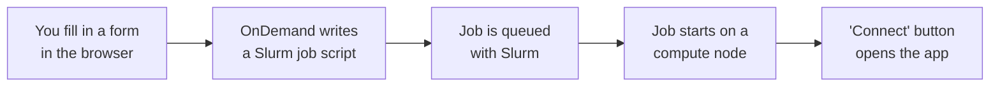
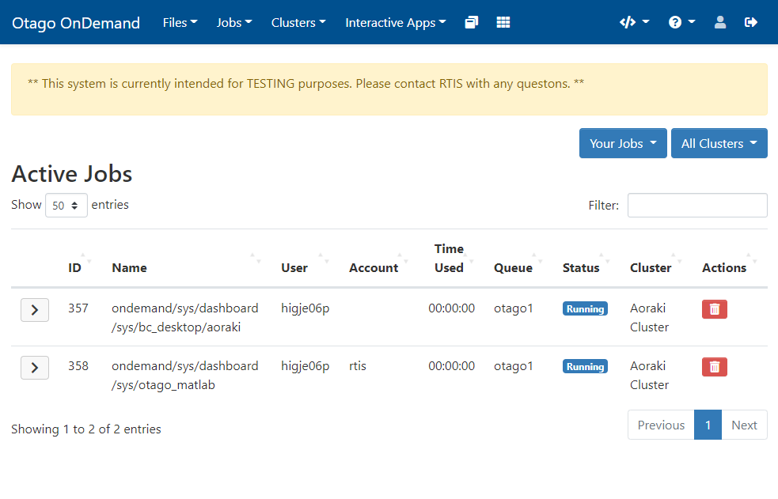
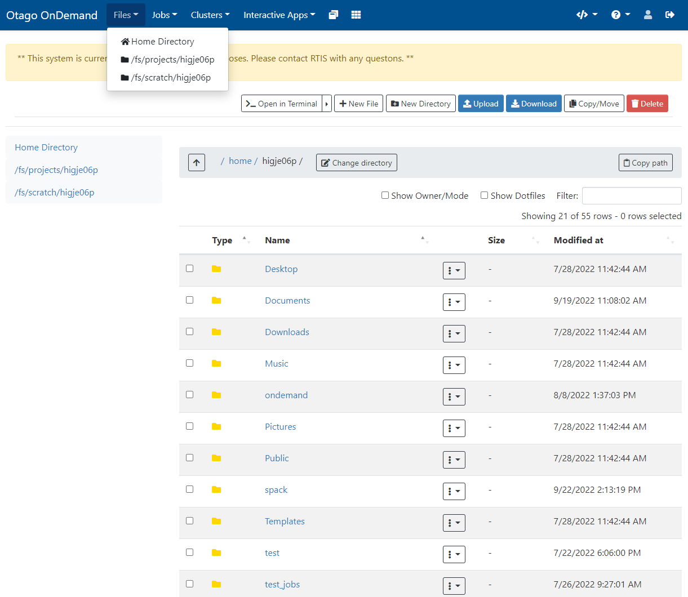
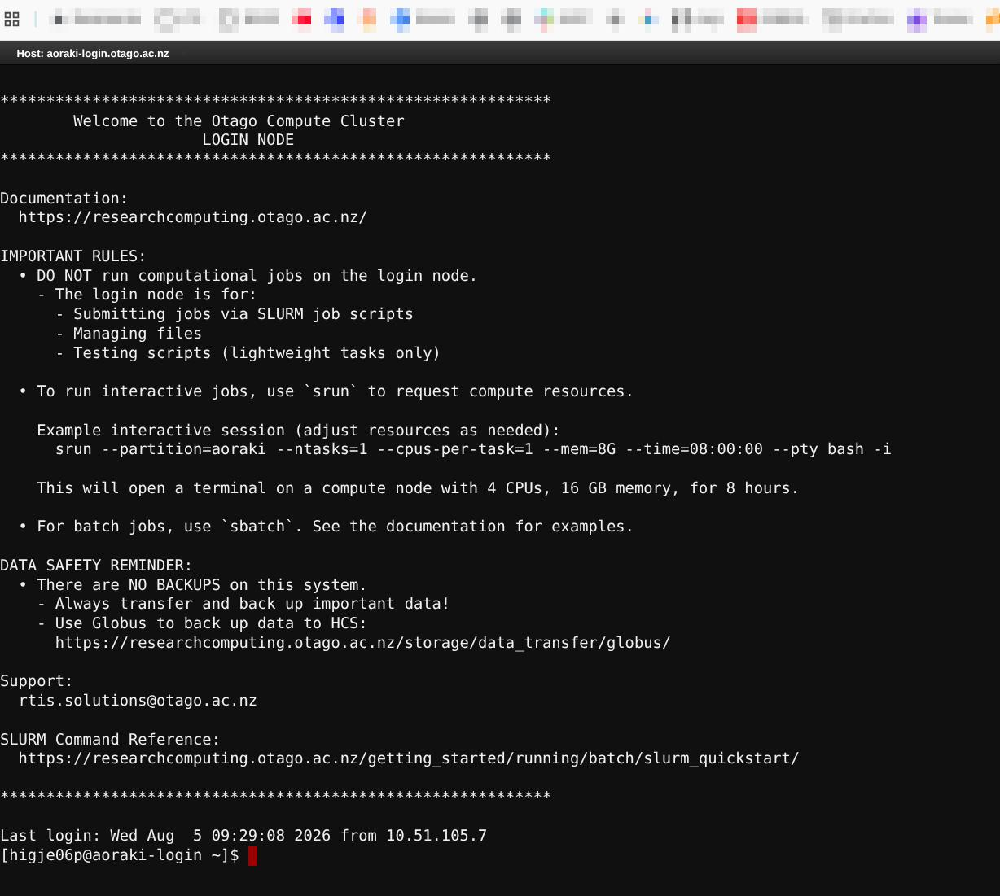
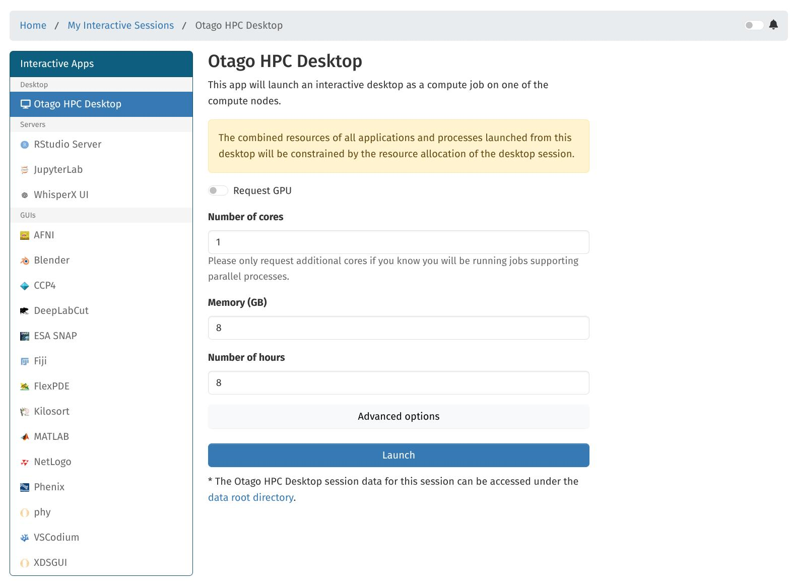

---
tags:
  - OnDemand
---

# Open OnDemand Overview

!!! overview "On this Page"
    - What Open OnDemand is and what it is for
    - How to get to the portal at ondemand.otago.ac.nz
    - How OnDemand uses Slurm to run your work
    - How your storage appears inside OnDemand
    - The apps and features available in the portal

## What is Open OnDemand?

Open OnDemand is the web portal for the Research Cluster. It gives you a browser-based way to use the cluster — launching applications, browsing files, checking on jobs, and opening a terminal — without installing an SSH client, an X server, or any other software on your own machine.

It is aimed at work that benefits from being interactive:

- Graphical applications such as MATLAB, Fiji, Blender or a full Linux desktop.
- Exploratory analysis in JupyterLab or RStudio.
- Quick file management, editing a script, or checking why a job failed.
- Getting started on the cluster before you are comfortable writing Slurm scripts.

For long-running, unattended, or large-scale work, batch jobs submitted with `sbatch` are still the better option. See [Running Jobs](../../running/running_jobs_overview.md) for help choosing between the two.

## Getting to the Portal

Open **[https://ondemand.otago.ac.nz](https://ondemand.otago.ac.nz)** in your web browser and sign in with your University of Otago email address and password.

<figure markdown="span" style="display: block; margin-left: 0; margin-right: auto;">
  { width="600px" }
</figure>

You need an account on the Research Cluster before you can log in. If you do not have one yet, [fill in the access form](../../access/signup.md) or email the eResearch Support team at **{{ support_email }}**.

!!! info "Two portals"
    A small number of applications have not yet moved to the current portal and remain on the legacy instance at [https://ondemand-legacy.otago.ac.nz](https://ondemand-legacy.otago.ac.nz). See [Available Apps](available_apps.md) for which apps live where.

!!! related-pages "What's next?"
    - Step-by-step login instructions, including MFA and troubleshooting, are on [Otago OnDemand (Web)](../../access/ondemand_web.md)

## How OnDemand Uses Slurm

Everything you launch from the **Interactive Apps** menu runs as a Slurm job on a compute node. OnDemand writes and submits that job for you, so you never have to write a batch script to get a graphical application running.

When you launch an app you fill in a short form — cores, memory, wall time, whether you need a GPU, and any options specific to that application. Those values become the resource request for the job. Because it is a normal Slurm job:

- **It has to queue.** If the cluster is busy your session waits until the resources you asked for are free. Asking for less usually means starting sooner.
- **It holds its resources for the whole wall time**, whether or not you are actively using it. Ask for a realistic wall time and delete the session when you are done.
- **It keeps running if you close your browser.** Closing the tab disconnects you; it does not end the job.
- **It shows up in Slurm like any other job.** `squeue` and `sacct` in a shell will list it alongside your `sbatch` jobs.

### Managing your sessions

Your running and recent sessions are listed under **My Interactive Sessions** on the dashboard. From there you can reconnect to a session, see how much wall time is left, or click **Delete** to end it and release the resources.

You can also see them, along with everything you have submitted with `sbatch` or `srun`, under **Jobs > Active Jobs**.

<figure markdown="span" style="display: block; margin-left: 0; margin-right: auto;">
  { width="600px" }
</figure>

### Limits on OnDemand jobs

A few cluster limits apply specifically to jobs started through OnDemand:

- You can have **10 running OnDemand jobs** at a time.
- OnDemand jobs are **limited to a single node**, as are any jobs requesting GPUs.
- OnDemand jobs do **not** count towards the 5000 submitted-job limit.

See the [Cluster Overview](../../../general/overview.md) for the full set of cluster limits.

## Your Data in OnDemand

Sessions run on the cluster itself, so they see the same storage you would see over SSH. The **Files** menu gives you a browser-based file manager for the locations you are most likely to work in; the rest are reachable from a shell or an HPC Desktop session.

| Location | Path | In the Files menu? | Notes |
| :-- | :-- | :-: | :-- |
| [Home directory](../../../storage/data_locations/homes.md) | `/home/<username>` | :material-check: | Scripts and configuration. Backed up, {{ home_quota }} quota. |
| [Projects](../../../storage/data_locations/projects.md) | `/projects/<division>/<school>/<dept>/<group>/` | :material-check: | Where your working research data should live. Not backed up. |
| [Weka](../../../storage/data_locations/weka.md) | `/weka/users/<username>` | :material-close: | High-throughput scratch, reachable from a shell or desktop session. |
| [Otago HCS](../../../storage/data_locations/hcs.md) | `/mnt/auto-hcs/<share>` | :material-close: | Needs a Kerberos ticket (`kinit`); mount it from a shell or desktop session. |

Copy the data you want to work on into `/projects/` first, then run your OnDemand session against it. HCS is not suited to being read from and written to directly during computation.

!!! related-pages "What's next?"
    - For where to put your data, see the [Storage Overview](../../../storage/storage_options.md)
    - For moving data on and off the cluster, see [Data Transfer](../../../storage/data_transfer/data_transfer_overview.md)
    - For day-to-day use of the built-in file browser, see [Using the OnDemand File Manager](ood_file_manager.md)

## What's in the Portal

### Files

**Files > Home Directory** (or **Projects**) opens the file manager. You can browse, create, rename, move and delete files and folders, upload and download, edit text files in the browser, and start a [Globus](../../../storage/data_transfer/globus.md) transfer with the **Open in Globus** button.

<figure markdown="span" style="display: block; margin-left: 0; margin-right: auto;">
  { width="600px" }
</figure>

[Using the OnDemand File Manager :material-arrow-right:](ood_file_manager.md){ .md-button }

### Jobs

**Jobs > Active Jobs** lists your queued and running jobs, whatever you started them with, and lets you cancel them. **Jobs > Job Composer** lets you write and submit a Slurm batch script from the browser — useful once you are ready to move beyond interactive sessions.

### Shell Access

**Clusters > Aoraki Shell Access** opens a terminal on the login node in a browser tab, equivalent to connecting over [SSH](../../access/login_ssh.md).

<figure markdown="span" style="display: block; margin-left: 0; margin-right: auto;">
  { width="600px" }
</figure>

[Accessing the Shell through OnDemand :material-arrow-right:](ood_shell.md){ .md-button }

### Interactive Apps

The **Interactive Apps** menu is the list of applications OnDemand can launch for you as Slurm jobs — JupyterLab, RStudio, MATLAB, Fiji, Blender and many more, plus the HPC Desktop.

<figure markdown="span" style="display: block; margin-left: 0; margin-right: auto;">
  { width="800px" }
</figure>

[Available Apps :material-arrow-right:](available_apps.md){ .md-button }

### HPC Desktop

The HPC Desktop gives you a full Linux desktop — XFCE or GNOME — running on a compute node, for graphical software that does not have a dedicated OnDemand app of its own.

If the software you need *does* have its own app (JupyterLab, RStudio, MATLAB and so on), use that instead: those apps are already configured for the job and are simpler to launch. And where your work can be done from the command line with a batch job, prefer that over a desktop session.

[OnDemand HPC Desktop :material-arrow-right:](hpc_desktop.md){ .md-button }

!!! related-pages "What's next?"
    - Choose which apps to launch from [Available Apps](available_apps.md)
    - Learn when to use an interactive session instead of a batch job in [Running Jobs](../../running/running_jobs_overview.md)
    - Looking for something else? See the [Software Overview](../index.md)
