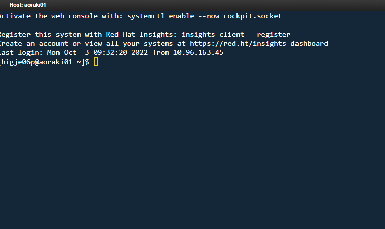

---
tags:
  - OnDemand
---

# Accessing the Shell through OnDemand

!!! overview "On this Page"
    - How to open a shell session from the OnDemand portal
    - What you can do in it
    - What you should not do in it

[Open OnDemand](ondemand.md) gives you command-line access to the cluster directly from your browser, without installing or configuring an SSH client. It is equivalent to connecting over [SSH](../../access/login_ssh.md), and lands you on the same login node.

## Opening a Shell Session

1. Log in to [https://ondemand.otago.ac.nz](https://ondemand.otago.ac.nz).
2. From the top menu, go to **Clusters > Aoraki Cluster Shell Access**.
3. A new tab opens with a terminal session connected to the cluster.

{width="600px"}{ .left }

## What You Can Do

- Run command-line programs and scripts.
- Submit and monitor Slurm jobs with `sbatch`, `squeue` and `sacct` — including the jobs behind your OnDemand [interactive sessions](ondemand.md#how-ondemand-uses-slurm).
- Navigate and manage your files with standard Linux commands, and reach storage the [File Manager](ood_file_manager.md) does not cover, such as [Weka](../../../storage/data_locations/weka.md) and [Otago HCS](../../../storage/data_locations/hcs.md).
- Use text editors such as `nano`, `vim` or `emacs`.
- Load software with `module`, or activate a conda or Apptainer environment — see the [Software Overview](../index.md).

!!! warning "The shell runs on the login node"
    The login node is shared by everyone and is not for computation. Do not run heavy work directly in this terminal — submit it as a [batch job](../../running/batch/slurm_quickstart.md), or start an [HPC Desktop](hpc_desktop.md) or other [interactive app](available_apps.md) so your work runs on a compute node.

## Tips

- Your shell session does not carry a Kerberos ticket automatically. If you need [Otago HCS](../../../storage/data_locations/hcs.md), run `kinit` first.
- You can open multiple shell sessions at once.
- If you are disconnected, just reconnect through the portal — anything you submitted with `sbatch` keeps running.

!!! related-pages "What's next?"
      - For more information about OnDemand see the [Open OnDemand Overview](ondemand.md)
      - For writing and submitting job scripts, see [Running Jobs](../../running/running_jobs_overview.md)
      - Looking for something else? See the [Software Overview](../index.md)
