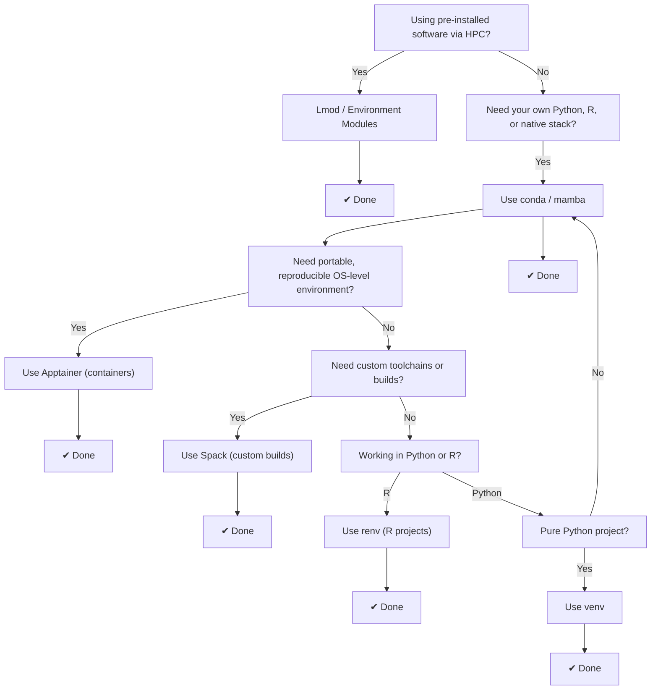

# Software Overview
!!! overview "On this Page"
      - What Software Options are available
      - When to use each Software Options
      - What Software Environments are available and what they are used for
 
  <!-- TODO See if overview is in line with content -->

<!-- TODO add an explanatory paragraph about how software is managed to provide context -->

## Available Software

Some software has been made available system wide, other software can be user installed and managed.

For a list of currently available software checkout the [List of installed software](applications/index.md)

## Managing your own Software

| Feature / Tool        | **Lmod / Modules**                 | **conda / mamba**                     | **Apptainer**                        | **Spack**                                  | **SBGrid**                             | **venv**                    | **renv**                      |
| --------------------- | ---------------------------------- | ------------------------------------- | ------------------------------------ | ------------------------------------------ | -------------------------------------- | --------------------------- | ----------------------------- |
| **Language Support**  | Language-agnostic                  | Multi-language (Python, R, etc.)      | Language-agnostic (container-based)  | Multi-language (C, Fortran, Python)        | Scientific tools (bio/chem/structural) | Python only                 | R only                        |
| **Scope**             | Manages *access* to software       | Packages + native/system dependencies | Full OS + environment                | Source builds + dependency trees           | Curated software suite                 | Python packages             | R packages                    |
| **Package Manager**   | N/A (env modules only)             | `conda`, `mamba`                      | None (uses definition files)         | `spack`                                    | SBGrid client                          | `pip`                       | `renv`                        |
| **Reproducibility**   | Medium (depends on loaded modules) | High (`environment.yml`, lockfiles)   | Very high (frozen image)             | High (via concretization + locks)          | High (versioned environment)           | Medium (`requirements.txt`) | High (`renv.lock`)            |
| **Binary Packages**   | N/A                                | Yes (conda-forge, etc.)               | Optional (user-defined or prebuilt)  | Mostly built from source                   | Yes (precompiled)                      | From PyPI (wheels)          | CRAN, Bioconductor            |
| **Non-language Deps** | Managed by system/site admin       | Built-in (e.g., OpenCV, HDF5, BLAS)   | Fully included in image              | Fully supported                            | Bundled per environment                | Manual (via OS tools)       | Manual or external            |
| **Custom Builds**     | No                                 | Some                                  | Yes (via definition file)            | Yes (fully configurable)                   | No                                     | No                          | No                            |
| **Cross-Platform**    | Depends on cluster/system          | Excellent (Windows/Linux/macOS)       | Excellent (Linux-native)             | Builds per target system                   | Linux/macOS                            | Good, minor issues          | Excellent                     |
| **HPC-Friendly**      | Yes (standard on clusters)         | Yes                                   | Yes (designed for HPC)               | Yes (made for HPC)                         | Yes                                    | Yes                         | Yes                           |
| **Best Use Case**     | Shared software on HPC systems     | Data science, ML, research computing  | Portable workflows, pipelines on HPC | Custom scientific toolchains               | Structural biology labs                | Simple Python apps          | R reproducibility & isolation |
| **Complexity**        | Low for users, high for admins     | Medium (lower with `mamba`)           | Medium (def files + CLI)             | High (very flexible, steep learning curve) | Very low (plug-and-play)               | Low                         | Low                           |
                |

| Use Case                                     | Recommended Tool(s) |
| -------------------------------------------- | ------------------- |
| **Shared HPC environments**                  | `Lmod / modules`    |
| **Python/R + system deps, easy setup**       | `conda / mamba`     |
| **Portable containers on HPC**               | `Apptainer`         |
| **Custom scientific software stacks**        | `Spack`             |
| **Ready-made scientific software (biology)** | `SBGrid`            |
| **Lightweight, local Python projects**       | `venv`              |
| **Reproducible R projects**                  | `renv`              |

Lmod/Modules: Exposes pre-installed tools with module load; used on HPCs for easy switching between compilers and software versions.

conda/mamba: General-purpose, language-aware environment + dependency manager; mamba is a faster drop-in.

Apptainer: Build-and-run container system for non-root, secure app packaging on HPC.

Spack: HPC-focused package manager for custom builds, compiler/toolchain control, and dependency isolation.

SBGrid: Plug-and-play scientific software stack (mainly structural biology); not customizable.

venv: Built-in tool for isolating Python projects.

renv: Lightweight and reproducible environment manager for R workflows.

 

