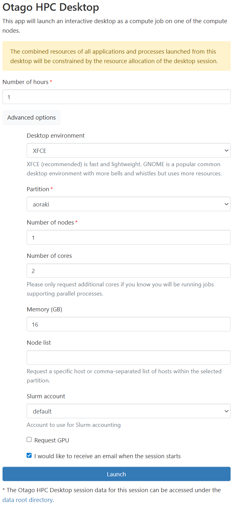
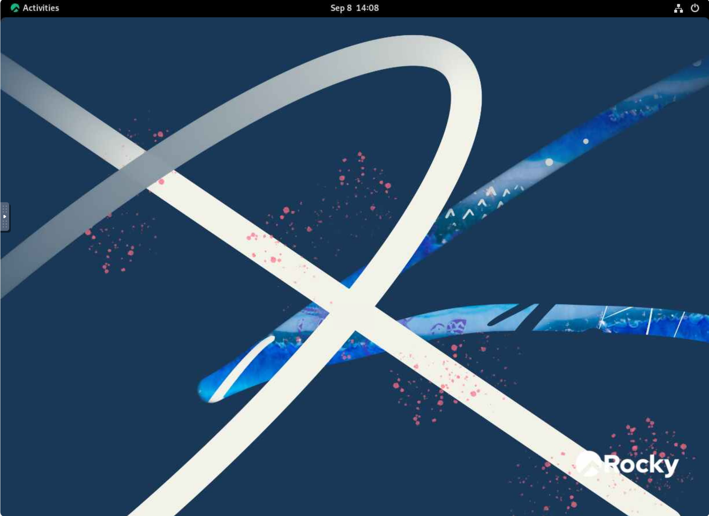
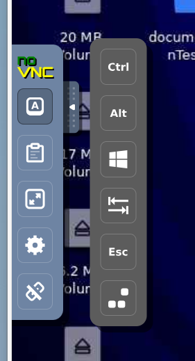
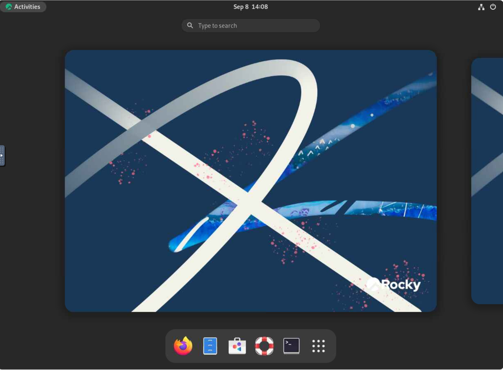
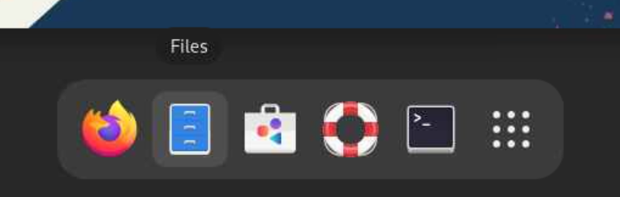
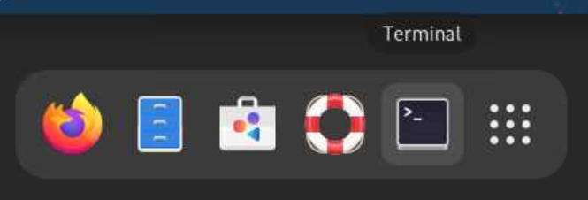
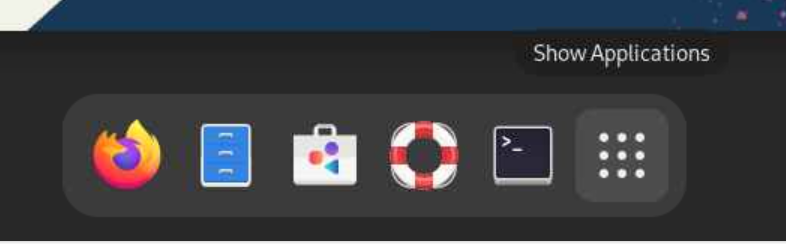

# OnDemand HPC Desktop
!!! overview "On this Page"
    - Key information when launching HPC Desktop
    - What the 2 different types of Desktops look like
    - Features available on each Desktop
    - Feature available on both Desktops
 
<!-- TODO See if overview is in line with content -->

## Launching HPC Desktop

When launching the desktop you can customise the computational components to suit your needs by clicking Advanced options. You can choose between 2 desktop environments XFCE and GNOME. If you have GPU intensive tasks select the "Request GPU" button.

When adjusting other components like cores and memory please refer to the guidelines <!--FIXME make a guidelines page or see if Nesi ones apply https://docs.nesi.org.nz/Getting_Started/Next_Steps/Finding_Job_Efficiency/ https://docs.nesi.org.nz/Getting_Started/Next_Steps/Job_Scaling_Ascertaining_job_dimensions/#initial-python-script https://docs.nesi.org.nz/Getting_Started/Next_Steps/MPI_Scaling_Example/--> or compare the job you want to run to previous jobs you have run.

{width="400px"}

Increasing compression will increase input lag but is better for low bandwidth connections. For image quality you want to decrease if you have a low bandwidth.

{width="600px"}

## HPC Desktop Overview

This is what the HPC Desktop Overviews look like there are 2 versions XFCE and GNOME.

{width="600px"}

{width="600px"}

## Both Desktops - Sidebar

The arrow to the left of the desktop opens the side bar.

{width="100px"}

### Extra Buttons

The Extra Buttons allow you to 'hold' down one or multiple buttons while using the desktop.

{width="200px"}

### Clipboard

Clipboard allows you to see what you last copied.

{width="600px"}

### Fullscreen

Puts the HPC Desktop into fullscreen mode.

{width="100px"}

### Settings

Settings allows you to adjust settings for connecting to the HPC Desktop. 

{width="200px"}

### Disconnect

Disconnects you from the HPC Desktop, you may need to relaunch the Desktop from Open OnDemand if you click this option.

{width="100px"}

## HPC Desktop Features
=== "XFCE Desktop"
    ### Taskbar
    Where you can switch between open application i.e. Firefox and Terminal. The grey boxes on the left allow you to switch between desktops.

    {width="700px"}

    The applications button on the left opens to access different applications and settings available on the HPC Desktop.
    {width="200px"}

    ### Terminal

    The terminal is used to run commands for various tasks. For example transferring data on to and from the cluster using [scp or rsync](../../data_transfer/rsync.md).

    {width="600px"}

    ### File Manager

    File manager allows you to see what files are stored on the HPC Desktop and interact with them for example copying, pasting or renaming.

    {width="600px"}

    ### Web Browser

    Web browser is a way to access the internet and search the web from the HPC Desktop.

    {width="600px"}

    ### Application Finder

    Application Finder helps you search applications available on your HPC Desktop.

    {width="600px"}

=== "GNOME Desktop"
    ### Toolbar to Taskview
    To access the toolbar click the activites button in the top left corner.
    {width="600px"}

    That will open the below screen where you can manage your desktops and access your toolbar.
    {width="600px"}

    ### Web Browser - Firefox

    Firefox is the web browser available on GNOME.
    Web browser is a way to access the internet and search the web from the HPC Desktop.

    {width="600px"}

    ### File Manager

    Files is the file manager on GNOME that allows you to see what files are stored on the HPC Desktop and interact with them for example copying, pasting or renaming.

    {width="600px"}

    ### Software
    
    Software allows you to see what software is installed, can be installed and needs updating.

    {width="600px"}
    
    ### Help
    
    Documentation to help you find and use features of the GNOME desktop.

    {width="600px"}

    ### Terminal

    The terminal is used to run commands for various tasks. For example transferring data on to and from the cluster using [scp or rsync](../../data_transfer/rsync.md).

    {width="600px"}

    ### Show Applications

    Show Applications displays the applications on the Desktop i.e. calculator or application finder.

    {width="600px"}

!!! related-pages "What's next?"
      - For more information about on Demand see [Open OnDemand](../onDemand/ondemand.md)
      - Looking for something else? See [Software Overview page](../software_overview.md)
      -  For how to run a job on the cluster go to [Running Jobs](../../running/running_jobs_overview.md)
      
  <!-- TODO Are these pages the next step or relevant? -->

  

