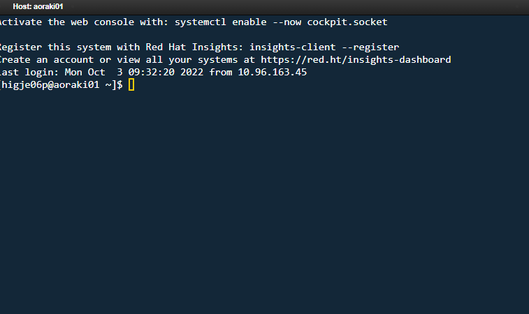

---
tags:
  - onDemand
---

# Open OnDemand 

!!! overview "On this Page"
    - What is Open OnDemand
    - How to get started with Open OnDemand
 
<!-- TODO See if overview is in line with content -->

<!-- TODO add initial OOD page screenshot -->
Open OnDemand (OoD) is a web portal that lets you launch applications, access files, and interact with the cluster—all from your browser, with no software installation needed. When you start an application or session, Open OnDemand submits a Slurm job for you. These are called "interactive sessions." You can also use the portal to view files, check job status, and open a shell.

**Key points:**

- Interactive sessions are Slurm jobs managed for you by Open OnDemand.
- Sessions will stay running even if you close your browser; you can see and manage them under "My Interactive Sessions."
- To end a session, click "Delete" next to it.

**Ways to monitor usage:**

- Use the Open OnDemand dashboard to see your running and recent sessions.
- Check **Jobs > Active Jobs** for all jobs (including those started by sbatch, srun, or Open OnDemand).
- Use standard Slurm commands (like `squeue`, `sacct`) in a shell session for more details.

## Using Open OnDemand

Open OnDemand provides several services:

### Files App

Access your files from the top menu: **Files > Home Directory**. You can:

- Create, delete, and move files and folders.
- Upload and download files.
- (Section on HCS and Globus to be added.)

<!--TODO section on HCS and globus -->

After logging in, you'll see the Open OnDemand home page.

{width="600px"}

!!! related-pages "What's next?"
      - Find more information on [Using the Open OnDemand File Manager](ood_file_manager.md)
      
  <!-- TODO Are these pages the next step or relevant? -->

### View Active Jobs

See and cancel your Slurm jobs from **Jobs > Active Jobs**. This includes jobs started via `sbatch`, `srun`, and Open OnDemand.

{width="600px"}

### Shell Access

Get command-line access to the cluster from the top menu bar options: **Clusters > Aoraki Cluster Shell Access**.

{width="600px"}

!!! related-pages "What's next?"
      - Find more information on [Accessing the Shell through Open OnDemand](ood_shell.md)
      
  <!-- TODO Are these pages the next step or relevant? -->

### Interactive Apps

Launch interactive applications from the **Interactive Apps** menu:

- **Desktop App**: For GUI-based programs.
- **Jupyter Server**: For Jupyter notebooks.
- **RStudio Server**: For RStudio sessions.

{width="600px"}

<!-- TODO update this image -->

### Desktop App

The OOD Desktop App allows you to run programs that require graphical user interfaces (GUIs) on the Research Cluster

Intended Usage

When possible, you should carry out your computation via the traditional command line plus SLURM functionality. OOD Desktop is intended for use for programs that require GUIs. Furthermore, if you need to use Jupyter notebooks, RStudio, or the MATLAB GUI, we provide specialized interactive apps that you should use instead of the OOD Desktop App.

Before getting started, make sure you have access to the Research Cluster (by contacting RTIS).

Fill out the form presented to you and then press "Launch". (Note, as of this time, that the only partition that the Desktop app can be launched on when computing via Slurm is otago1, as we assume that most GUI usage would be for programs using one or a small number of cores). After a moment, the Desktop session will be initialized and allow you to specify the image compression and quality options. If you are unhappy with the default values, you can relaunch the session from this page with different choices. Then, press "Launch Desktop" and the Desktop will open in a new tab.

!!! related-pages "What's next?"
      - Find more information on [OnDemand HPC Desktop](hpc_desktop.md)
      
  <!-- TODO Are these pages the next step or relevant? -->

### Interacting with Files

Your Desktop session is running directly on the Research Cluster, and can interact with your files either through the command line as usual or through Desktop the file manager.

To open a command line terminal, right click anywhere on the Desktop and select "Open Terminal Here".

#### Using Otago HCS Data

1. Connect to the HCS Share
2. Copy your data to your projects directory
3. Process your data with the cluster
4. Copy your results back to the HCS Share 

Note: Connecting to Otago HCS is intended for copying data to the Research Clutster for processing. **It is not intended for data processing** as the speeds and accessibility are not suited to cluster computing.

#### Connecting to Otago HCS Shares

**AutoFS from the commandline**  

This will mount your HCS share on the local machine and allow you to access and sync files. Note that this is not high-speed access and handling large files may be slow. 

  1. Take note of your HCS share directory name, the part after `//storage.hcs-p01.otago.ac.nz/ **<yourshare>** `   
  2. Login to a commandline shell session 
  3. Type "kdestroy" to remove invalid older tickets
  4. Type "kinit" and Enter your password  
  5. List or navigate to yoru directory `/mnt/auto-hcs/*<yourshare>* ` 
  6. sync your files to your projects directory eg. `rsync -avz /mnt/auto-hcs/its-rtis/testfile /projects/rtis/higje06p/`  
  7. use your files to process on the compute cluster   

#### Copy your HCS data to your project directory

1. Naviagate to your hcs data and copy it to your user projecy directory

    {width="600px}

2. When you have finished processing copy your data back to your HCS Share.

!!! related-pages "What's next?"
      - Looking for something else? See [Software Overview page](../index.md)
      -  For how to run a job on the cluster go to [Running Jobs](../../running/running_jobs_overview.md)
      
  <!-- TODO Are these pages the next step or relevant? -->

