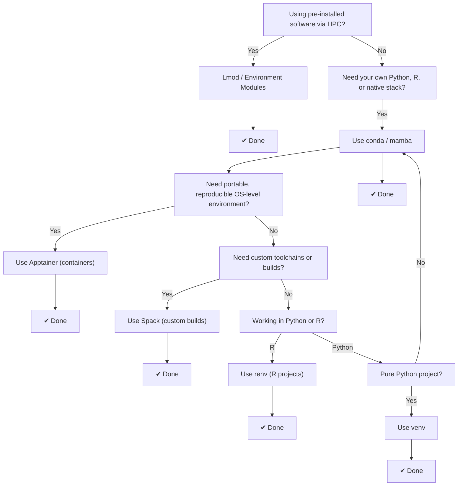

# Software Overview

## Available Software

## Managing your own Software

| Feature / Tool        | **Lmod / Modules**                 | **conda / mamba**                     | **Apptainer**                        | **Spack**                                  | **SBGrid**                             | **venv**                    | **renv**                      |
| --------------------- | ---------------------------------- | ------------------------------------- | ------------------------------------ | ------------------------------------------ | -------------------------------------- | --------------------------- | ----------------------------- |
| **Language Support**  | Language-agnostic                  | Multi-language (Python, R, etc.)      | Language-agnostic (container-based)  | Multi-language (C, Fortran, Python)        | Scientific tools (bio/chem/structural) | Python only                 | R only                        |
| **Scope**             | Manages *access* to software       | Packages + native/system dependencies | Full OS + environment                | Source builds + dependency trees           | Curated software suite                 | Python packages             | R packages                    |
| **Package Manager**   | N/A (env modules only)             | `conda`, `mamba`                      | None (uses definition files)         | `spack`                                    | SBGrid client                          | `pip`                       | `renv`                        |
| **Reproducibility**   | Medium (depends on loaded modules) | High (`environment.yml`, lockfiles)   | Very high (frozen image)             | High (via concretization + locks)          | High (versioned environment)           | Medium (`requirements.txt`) | High (`renv.lock`)            |
| **Binary Packages**   | N/A                                | Yes (conda-forge, etc.)               | Optional (user-defined or prebuilt)  | Mostly built from source                   | Yes (precompiled)                      | From PyPI (wheels)          | CRAN, Bioconductor            |
| **Non-language Deps** | Managed by system/site admin       | Built-in (e.g., OpenCV, HDF5, BLAS)   | Fully included in image              | Fully supported                            | Bundled per environment                | Manual (via OS tools)       | Manual or external            |
| **Custom Builds**     | No                                 | Some                                  | Yes (via definition file)            | Yes (fully configurable)                   | No                                     | No                          | No                            |
| **Cross-Platform**    | Depends on cluster/system          | Excellent (Windows/Linux/macOS)       | Excellent (Linux-native)             | Builds per target system                   | Linux/macOS                            | Good, minor issues          | Excellent                     |
| **HPC-Friendly**      | Yes (standard on clusters)         | Yes                                   | Yes (designed for HPC)               | Yes (made for HPC)                         | Yes                                    | Yes                         | Yes                           |
| **Best Use Case**     | Shared software on HPC systems     | Data science, ML, research computing  | Portable workflows, pipelines on HPC | Custom scientific toolchains               | Structural biology labs                | Simple Python apps          | R reproducibility & isolation |
| **Complexity**        | Low for users, high for admins     | Medium (lower with `mamba`)           | Medium (def files + CLI)             | High (very flexible, steep learning curve) | Very low (plug-and-play)               | Low                         | Low                           |
                |

| Use Case                                     | Recommended Tool(s) |
| -------------------------------------------- | ------------------- |
| **Shared HPC environments**                  | `Lmod / modules`    |
| **Python/R + system deps, easy setup**       | `conda / mamba`     |
| **Portable containers on HPC**               | `Apptainer`         |
| **Custom scientific software stacks**        | `Spack`             |
| **Ready-made scientific software (biology)** | `SBGrid`            |
| **Lightweight, local Python projects**       | `venv`              |
| **Reproducible R projects**                  | `renv`              |

Lmod/Modules: Exposes pre-installed tools with module load; used on HPCs for easy switching between compilers and software versions.

conda/mamba: General-purpose, language-aware environment + dependency manager; mamba is a faster drop-in.

Apptainer: Build-and-run container system for non-root, secure app packaging on HPC.

Spack: HPC-focused package manager for custom builds, compiler/toolchain control, and dependency isolation.

SBGrid: Plug-and-play scientific software stack (mainly structural biology); not customizable.

venv: Built-in tool for isolating Python projects.

renv: Lightweight and reproducible environment manager for R workflows.

 

### Software Environments

#### Containers

Containerization is a technology that allows you to package an application together with everything it needs to run — code, libraries, dependencies, and environment settings — into a single, portable unit called a container.

Think of a container like a lightweight, standalone mini-computer that runs consistently anywhere — on your laptop, on a server, or on a supercomputer — regardless of the underlying system.

##### Apptainer

What is Apptainer?

Apptainer (previously called Singularity) is a container platform designed specifically for High-Performance Computing (HPC) environments.

Why Apptainer over Docker in HPC?
- Docker needs root/admin access → Not allowed on most HPC clusters.
- Apptainer is designed to run containers as non-root → Safe for shared systems.

Apptainer integrates better with HPC tools (like MPI, GPUs, file systems).

What is Apptainer Good For?
- Packaging scientific software & dependencies.
- Running complex workflows reproducibly.
- Sharing pre-configured environments.
- Moving workloads between different systems easily (laptop → HPC → cloud).

For more information see the [Apptainer page](software_environments/self_managed/apptainer.md)

#### Environments

##### LMOD/Modules

Lmod (Lua Modules) is an environment module system commonly used on High-Performance Computing (HPC) systems, clusters, and supercomputers. It helps users easily manage and switch between different software environments.

For more information see the [Modules (LMOD) page](software_environments/modules/modules.md)

##### Conda/Mamba

Conda/mamba is an open-source package management and environment management system. It was developed to simplify installing, running, and managing software packages and their dependencies, especially for data science, machine learning, and scientific computing.

- Environments can be created locally and recreated on the research cluster
- Environments can be created per project
- Conda/Mamba manage software dependencies for reproducible research.
- Install non-Python libraries (like TensorFlow, OpenCV, etc.) easily.
    - bioconda is a great source of bioinformatic tools

For more information see the [Conda/Mamba page](software_environments/self_managed/conda.md)

##### Spack

Spack is a flexible, open-source package manager designed specifically for supercomputers, HPC clusters, and scientific computing. It helps users build, install, and manage multiple versions of scientific software and their complex dependencies.

For more information see the [Spack page](software_environments/self_managed/spack.md)

##### SBGrid

SBGrid is a specialized software distribution and management system designed primarily for the structural biology community. It provides a curated collection of scientific software used in fields like:

- X-ray crystallography
- Cryo-electron microscopy (Cryo-EM)
- NMR spectroscopy
- Molecular modeling and visualization

For more information see the [SBGrid page](software_environments/sbgrid.md)

##### venv

venv is a built-in Python tool (since Python 3.3) used to create virtual environments. A virtual environment is like a self-contained Python workspace — it has its own Python interpreter and its own set of installed packages, completely separate from the system Python.

Why is venv Useful?

When working on multiple Python projects:

- Different projects might need different versions of the same package.
- Installing everything globally could lead to version conflicts.

venv solves this by isolating environments.

What is venv Good For?

- Keeping project dependencies separate.
- Avoiding conflicts between package versions.
- Preventing changes to system-wide Python packages.
- Making projects easier to share & reproduce.

For more information see the [venv page](software_environments/self_managed/venv.md)

##### renv

`{renv}` is an R library that is used to create virtual environments of R packages. These environments can be at the user or project level and help to isolate the packages used for a project from the versions installed at a system level.

renv is useful for when you want to ensure your package versions are controlled by you, or if you want to ensure the same package versions are used across multiple devices or collaborators.

What is renv Good For?

- Keeping project dependencies separate.
- Preventing changes to system-wide R packages.
- Making projects easier to share & reproduce.

For more information see the [renv page](software_environments/self_managed/renv.md)