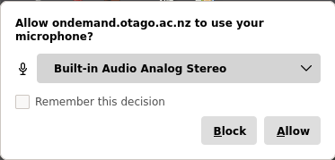
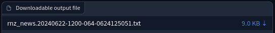
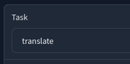

# Audio/Video Speech-to-Text Transcription & Translation

**Offline** speech-to-text services may be necessary in situations where **privacy** is crucial, such as **sensitive** interviews or when working with **classified** information. This ensures that the data is not shared outside of the local University environment and does not rely on an external cloud-based service for processing.

* STT Speech-to-Text
* ASR Automatic Speech Recognition

## Whisper

[Whisper](https://github.com/openai/whisper) is an open source machine learning model created by OpenAI for speech recognition, transcription and translation. It can be used freely and offline.

We have deployed a basic web user interface using the Whisper model, available on the [eResearch OnDemand cluster](https://ondemand.otago.ac.nz) (as AI models such as Whisper require a lot of compute resources to run) which allows for easy **transcription, subtitling or translation of audio and video recordings**.

### Getting access

* [Sign up](https://ask.otago.ac.nz/otagoresearchcluster) for access to the eResearch Compute Cluster if you haven't already.

* Once you are onboarded, browse to [Otago OnDemand](https://ondemand.otago.ac.nz) and find the `Whisper (Speech-to-Text)` app (or follow this [direct link](https://ondemand.otago.ac.nz/pun/sys/dashboard/batch_connect/sys/ood_whisper-webui_apptainer)).

* In the Whisper app launch form, leave all options as default, and click the 'Launch' button

* Wait for the session to get scheduled on one of the cluster nodes; then click the 'Connect to Whisper WebUI' button.

* (aadnk version): If prompted to allow microphone access, this can be blocked/disallowed if you are not planning to make live recordings using the microphone.

{width=220}

 

### Transcription quickstart

* In the Upload Files tab, drag and drop an audio or video recording file in the 'Drop File here' area, or click to select a file from your local drive. 
(aadnk version): Multiple files can be selected; These will then be processed sequentially, with outputs bundled in a zip archive.

{width=100}

* Select the source material language, or leave it empty to automatically detect it.

* Speaker diarisation (i.e. *"who spoke when"*) can be enabled by ticking the 'Diarisation' option (See [Speaker diarisation](#speaker-diarisation) below). Set the 'Diarisation - Speakers' field to the number of speaker if known (which improves accuracy), or set to `0` to enable automatic detection.

  * The diarisation process will add additional processing time after the transcription phase, and progress currently is not reflected in the user interface; i.e. The progress bar will just appear to hang at 100% -- Be patient.

* Other settings can be left as default. Click the 'Submit' button when ready to start.

* The very first time, the required AI model files will get downloaded to your research home directory. Depending on the selected model, this can be sizeable and will take some additional time to initialise.

* When finished, the transcribed text should show up in the output pane, and the resulting output files will be available for download in the 'Downloads' section. Click the down arrow to download files to your local machine.

{width=320}

### Translation quickstart

*For document text-to-text translation, see* [Translation](translate.md).

Follow the same steps as per *Transcription quickstart*, only now selecting the `translate` option under *Task*.

{width=200}

For translations it is recommended to select the multilingual `large-v3` model. (See [Model selection](#model-selection)).
See [Translation](#translation) below for additional pointers.

### Model selection

Several trained models are available; Larger models will add accuracy, at the cost of processing time and resource consumption.
The `small` model has the best quality/accuracy to speed/performance ratio, and is suitable for most English-language transcription use cases.
Larger models can be slightly more accurate, but at the cost of added time and increased resource utilisation.

For translations, the multilingual `large` models may be required; If the language is known and language identification is reliable, it is better to opt for the `large-v3` model. 
Whisper's `large-v2` may perform better for unknown languages. 
When selecting larger models, ensure your OnDemand app session was started with sufficient compute resources.

### Processing time

* When run for the first time, the latest version of the required AI model(s) will be downloaded to your research home directory on the cluster; This will take some additional time.
* The model size selected is a crucial factor in the time it will take to transcribe your recording.
* Features such as VAD and Speaker Diarisation will add additional processing time

*As an example: Processing a half hour long interview with the 'medium' model and speaker diarisation enabled, shouldn't take more than 1-2 minutes.*

### Input

* Most common audio and video formats are supported
* Audio quality, background noise, overlapping conversations, etc. will most likely lead to poorer transcription results.

### Speaker diarisation

Speaker diarisation (i.e. the process of identifying *"who spoke when"*) adds speaker labels to the different segments. It helps readers follow a transcript, and is also essential when having transcripts analysed by an [LLM](llm.md) by adding more structure and context.

Diarisation is not supported by the Whisper model itself, but is implemented as a separate step using a different model and library. The results of the Whisper transcription and diarisation are then "merged" for basic speaker diarization.

When diarisation is enabled, different speakers will be identified and labeled as `SPEAKER_00`, `SPEAKER_01`, etc. in the text output, subtitle files (srt, vtt), and in the HTML output (the latter which will additionally have the different speaker segments colourised for easy reading).

To enable this, select the 'Speaker diarisation' checkbox, and if known, always try to set the number of speakers for improved accuracy. 

The speaker diarisation process will add significant additional processing time after the transcription phase -- Be patient.

Speaker identification is not perfect, particularly in challenging audio conditions. The accuracy of the speaker labeling:

  * depends on how unique each voice is in a recording. Anecdotally the diarisation model seems to have more accuracy issues distinguishing between female voices.

  * depends on the audio quality. 

  * depends on the number of speakers. The more speakers there are, the less accurate machine diarisation will be.

  * If there are multiple speakers talking over each other, diarisation may not be able to separate out each individual speaker. 

### Translation

Translation performance varies widely depending on the source language.

While the underlying model was trained on 98 languages, only the languages are listed that exceeded <50% *word error rate* (WER) which is an industry standard benchmark for speech to text model accuracy. The model may work for languages not listed but the quality will be low.

The plot below shows WERs for all languages where Whisper `large-v3` performs lower than 60% error rate on [Common Voice - Corpus 15](https://commonvoice.mozilla.org/en/datasets)  and [FLEURS](https://huggingface.co/datasets/google/fleurs).

](../../assets/images/whisper/table.svg)

### Translations to non-English
 
The *translate* task will translate **to English**. 
Translating into languages other than English wasn't a part of the training objective for the Whisper models.
However it may still be possible to produce a reasonble non-English translation with these settings:

  * Set the model to `large-v3`
  * Set the language to the non-English *target* language
  * Somewhat counterintuitively, set *Task* to **transcribe**, *not* translate.
  * Set VAD to `silero-vad`
  * Set VAD mode to `prepend_first_segment`
  * Optionally, set an *initial prompt* in the wanted target language  (See [Advanded prompting](#advanced-prompting) ), such as a prompt that translates to "*The following are sentences in {target language}*". 
      * e.g. "*Ce qui suit sont des phrases en français.* "

### VAD (Voice Activity Detection)

VAD is part of the WhisperX pipeline and enabled by default in the Whisperx version.

Using a VAD will improve the timing accuracy of each transcribed line, as well as prevent Whisper getting into an infinite loop detecting the same sentence over and over again. The downside is that this may be at a cost to text accuracy, especially with regards to unique words or names that appear in the audio. You can compensate for this by increasing the prompt window.

English is generally very well handled by Whisper, and it's less susceptible to issues surrounding bad timings and infinite loops.
So you may only need to use a VAD for other languages, or for longer recordings (>10 min).

### Advanced prompting

It is possible to **steer the model in a specific direction** by using an *initial prompt*. This may be necessary to enforce particular spellings, use of specific words, or specify otherwise ambiguous styles, and this feature can also be used to force non-English translations or transcription. (See [Translation](#translation))

This option is available as *Initial Prompt* on the *Full* tab.

One example: When transcribing Mandarin, adding the following initial prompt "以下是普通話的句子。" should nudge the model to use traditional Chinese, vs
the prompt "以下是普通话的句子。" for simplified Chinese.

### Output

* Output formats:

  * `txt`: Plaintext transcript without timestamps
  * `html`: HTML transcript with colourised speaker identification including timestamps
  * `srt`: SubRip subtitle file
  * `vtt`: WebVTT subtitle file
  * `json`: used for an intermediate step in the diarisation process

* As with all AI-based automated audio transcription systems, **resulting transcripts should be carefully checked**.
* Most nonverbal expressions like laughter or filler words will not get captured;  If that is important for your analysis, these may need to be added manually in postprocessing.
* The output files list in the 'Download' section is not persisted beyond your current session.
    * The actual files however (generated transcripts, uploaded audio files, as well as Whisper model files) *are* stored in your research home directory under `~/.whisper/`. These can be accessed/transferred/deleted from the [OOD Files app](../../getting_started/software/onDemand/ondemand.md#files-app). Make sure to tick the *Show dotfiles* option to show the hidden `.whisper` folder.

Subtitle files can overlay your audio/video recording using a capable media player (e.g. [VLC](https://www.videolan.org/vlc/)), while the colourised HTML transcripts can be opened in a browser and are easy to read.

Tip: In VLC, in order to show the subtitle file for an audio file, you may need to enable an audio visualisation plugin, e.g. `Audio > Visualizations: Spectrometer`.

Transcripts could also be fed into [LLM models](llm.md) for further processing, e.g. analysis, categorisation or summarisation. 

### Known issues and limitations

* Speaker identification is not perfect. See [Speaker diarisation](#speaker-diarisation)` above.
* There are some particular quirks that may occasionally happen when using these ASR AI models, such as getting stuck in a loop of repeating text, or interpretation of background noise or silence as 'text'. This should be greatly reduced in the WhisperX version.

### Technical details

The frontend application is developed in the [Gradio](https://www.gradio.app/) framework.
The WhisperX version UI code is available at [https://github.com/gimmw/c3-whisperx-gradio](https://github.com/gimmw/c3-whisperx-gradio), a customised fork of [https://github.com/comput3ai/c3-whisperx-gradio](https://github.com/comput3ai/c3-whisperx-gradio) that uses the [WhisperX]https://github.com/m-bain/whisperX) pipeline.

The code repository for the `aadnk` version can be found at [https://github.com/gimmw/whisper-webui-diarisation](https://github.com/gimmw/whisper-webui-diarisation); This is a customised fork of [https://gitlab.com/aadnk/whisper-webui](https://gitlab.com/aadnk/whisper-webui) using [faster-whisper](https://github.com/SYSTRAN/faster-whisper) and [pyannote](https://github.com/pyannote) for segmentation and speaker diarisation.

All of the code used is free & open source software, and [OpenAI Whisper](https://openai.com/index/whisper/)'s code and model weights are released under the MIT License.
