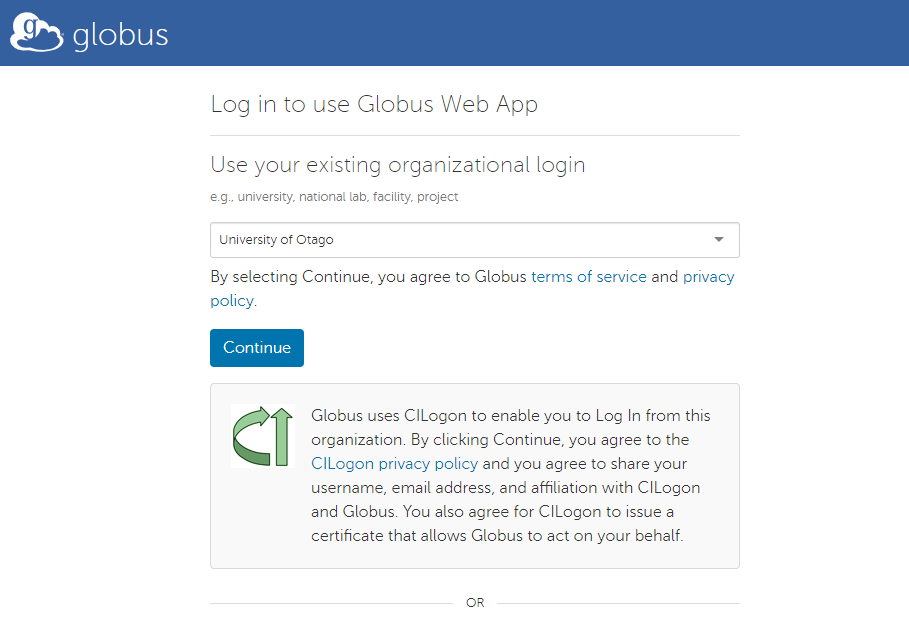
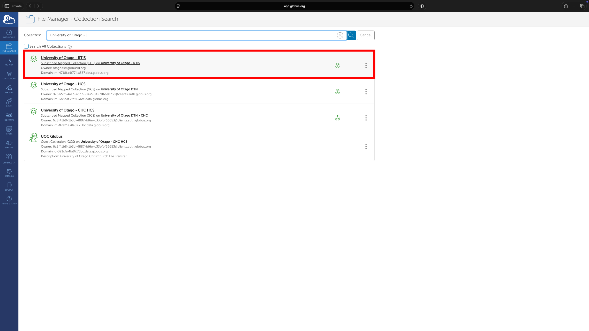
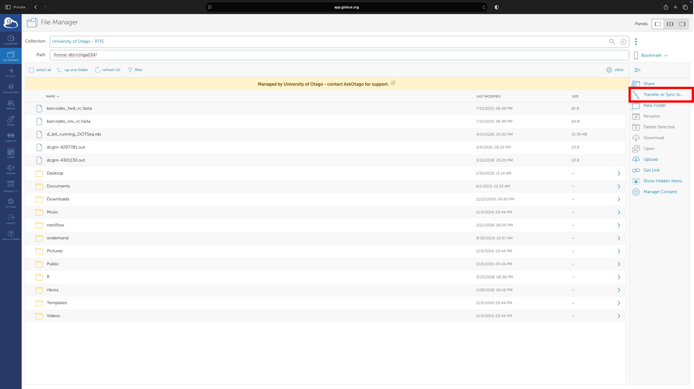
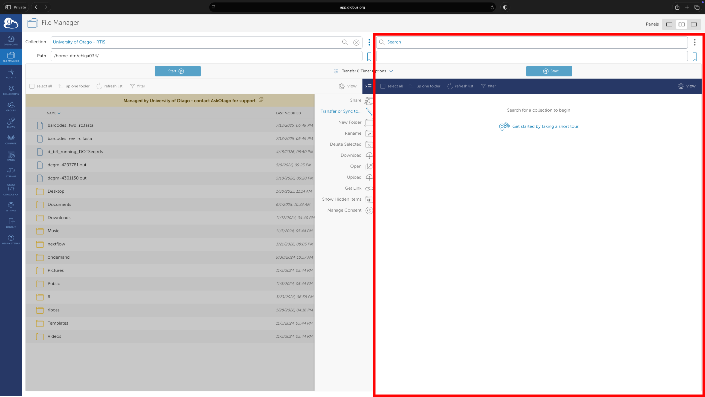
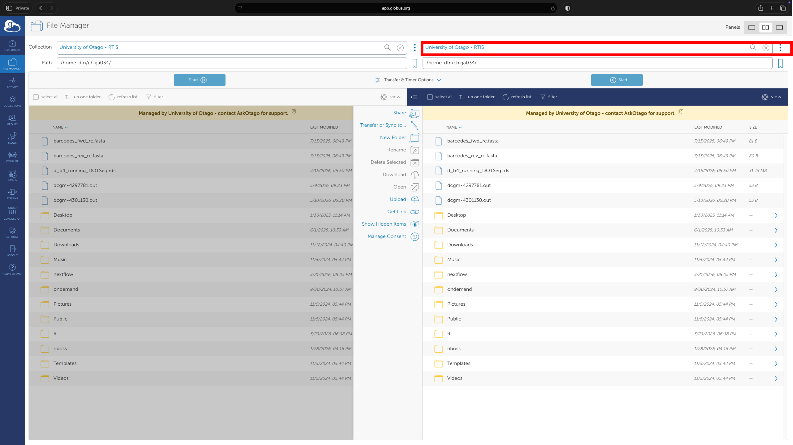
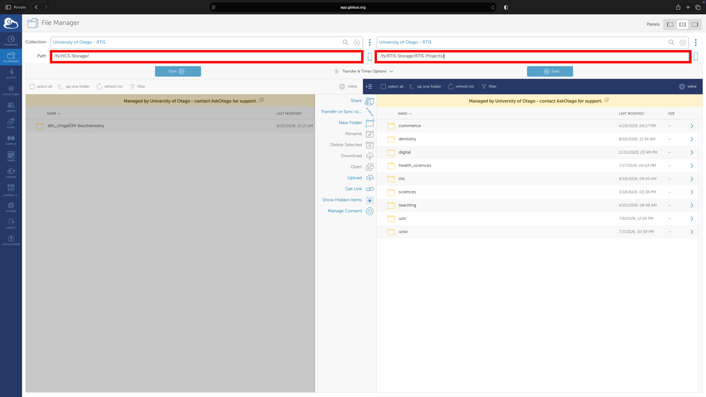
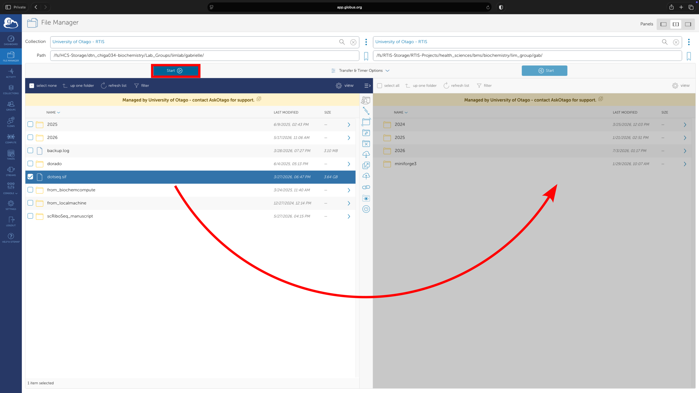

!!! overview "On this Page"
      
      - Sign up for Globus
      - How to use Globus to transfer data between High Capacity Storage (HCS) and Research Storage (Ohau)
      - Using Globus Conect Personal to transfer data between the Ohau and your desktop

## Before You Start

!!! warning
    If you haven't already registered for Globus access, please see [Globus Registration](./globus_registration.md) to set up your account.

**[Globus](https://www.globus.org/)** is a high-speed, secure data transfer platform that is available to all University of Otago researchers.

It is a great way to transfer large amounts of data between Otago HCS and the Research Cluster Storage (Ohau - /projects), as well as to external institutes.

## How to Transfer Data between Otago HCS and Ohau using Globus

If you have used Globus before, this process will look a little bit different than you are used to, so please read ahead. You will need to ensure you are logging in to Globus via your University of Otago login.

### Step 1: Log in to Globus 

Go to [app.globus.org](https://app.globus.org/) and search for "University of Otago" in the "Use your existing organizational login" section of the page. 

This will redirect you to a University of Otago login page and please sign in with your University username and password.

<figure markdown="span" style="display: block; margin-left: 0; margin-right: auto;">
  { width="800" }
  <figcaption>Choose "University of Otago" from the organisation drop down.</figcaption>
</figure>

!!! note
    You may be prompted to link any existing Globus identities. Do this if you want to link your GlobusID account with your Otago account.

### Step 2: Setting Up the Endpoints

Select the File Manager tab on the left side of the page, and search for **University of Otago - RTIS** endpoint in the **Collection** search box.

!!! note
    The **University of Otago - HCS** endpoint is for off-campus transfers and should not be used for transfers between Ohau and HCS.

<figure markdown="span" style="display: block; margin-left: 0; margin-right: auto;">
  { width="800" }
  <figcaption></figcaption>
</figure>

Once the endpoint is selected, you will be directed to the home directory by default. 

To open up another tab for the transfer destination, select the **Transfer or Sync** data tab.

<figure markdown="span" style="display: block; margin-left: 0; margin-right: auto;">
  { width="800" }
  <figcaption></figcaption>
</figure>

<figure markdown="span" style="display: block; margin-left: 0; margin-right: auto;">
  { width="800" }
  <figcaption></figcaption>
</figure>

Select **University of Otago - RTIS** as the endpoint for the new tab as well.

<figure markdown="span" style="display: block; margin-left: 0; margin-right: auto;">
  { width="800" }
  <figcaption></figcaption>
</figure>

### Step 3: Setting Up the Paths for Data Transfers

The path to the Otago HCS and Ohau is different on Globus. Please refer to the table below:

Table: Mapping of key locations between Aoraki and Globus (University of Otago - RTIS endpoint)

| Directory| Aoraki Path | Globus Path |
|---|---|---|
| Home |/home/<account_name\> (~/) | /home-dtn/<account_name\> (~/) |
| Projects | /projects/ | /fs/RTIS-Storage/RTIS-Projects |
| HCS |/mnt/auto-hcs/<hcs sharename\> | /fs/HCS-Storage/<dtn_username\> |

For example, to transfer data from the Otago HCS share to Ohau, the paths for Otago HCS Share is set to **/fs/HCS-Storage/** while the Ohau is set to **/fs/RTIS-Storage/RTIS-Projects/** and hit **Enter**.

You should then see the files in your Ohau collection on the right tab as well as the Otago HCS collection (with dtn_<username>) on the left tab.

<figure markdown="span" style="display: block; margin-left: 0; margin-right: auto;">
  { width="800" }
  <figcaption></figcaption>
</figure>

!!! note
    The dtn-sharename may or may not match exactly to the hcs sharename but should be interpretable.

### Step 4: The Transfer

Select the directories or files you want to transfer, then click the **Start** arrow pointing in the direction of your desired transfer.

In this example, the **dotseq.sif** file is being transferred from the Otago HCS Share to Ohau:

<figure markdown="span" style="display: block; margin-left: 0; margin-right: auto;">
  { width="800" }
  <figcaption></figcaption>
</figure>

If you have any issues with Globus, please contact us at {{support_email}}.

## How to Transfer Data between Ohau and Your Desktop using Globus Connect Personal

The University of Otago - RTIS endpoint works with [Globus Connect Personal](https://www.globus.org/globus-connect-personal) and will transfer data to and from your desktop or lab computer.

To transfer data between your desktop and Ohau, you will need to install the Globus Connect Personal application on your desktop. Follow the instructions on the [Globus Connect Personal](https://www.globus.org/globus-connect-personal) page to install it.

Once you have installed Globus Connect Personal, you can connect your desktop endpoint to the RTIS Globus endpoint and transfer data between your desktop and Ohau.

!!! note
    Reminder - The **University of Otago - HCS** endpoint does not work with Globus Connect Personal on campus, but does allow you to share and receive data from other Globus users off campus*

!!! related-pages "What's next?"
    - To transfer data between your desktop and Research Storage go to [Globus Connect Personal](https://www.globus.org/globus-connect-personal)
    - For software available on the cluster go to [Software](../../getting_started/software/applications/index.md)
    - Connect to the cluster and view your files [Connect to the Cluster](../../getting_started/access/access_overview.md)
    - For how to run a job on the cluster go to [Running Jobs](../../getting_started/running/running_jobs_overview.md)
  
  <!-- TODO Are these pages the next step or relevant? -->