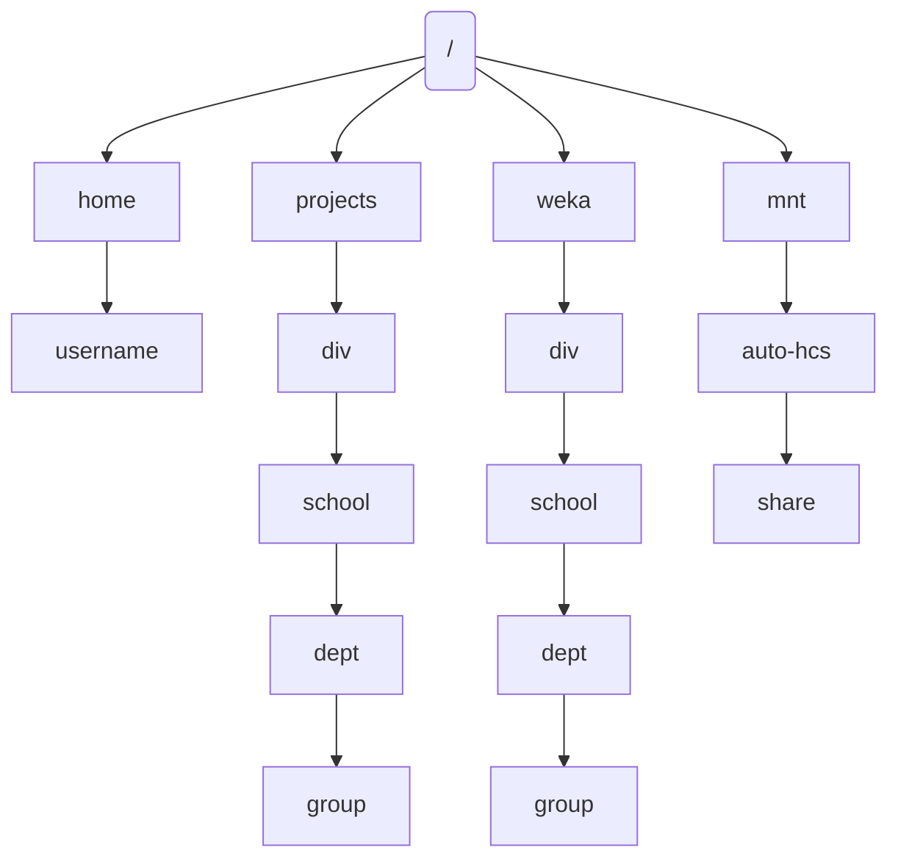

# Storage Overview
!!! overview "On this Page"
      - What storage locations are available 
      - When to use each storage location
      - Backing up your data

  <!-- TODO See if overview is in line with content -->

RTIS provides high-performance storage solutions for researchers at the University of Otago. These storage solutions are available on the [Research Cluster](../general/overview.md) to all researchers at the University of Otago upon application approval.

|        | Home directory | RTIS (Ohau) Storage | WEKA | High capacity storage   |
| :----- | :-------------------------------------------- | :----------------------------------- | :----- |:---|
| __Ideal Use__ | Storage of scripts and configuration files |Research data you are working on      | Workflows that require very high speed data reading/writing  | Long term storage of important research data 
|_Mount point_| `/home/<username>` | `/projects/<division>/<school>/<dept>/<group>/` | `/weka/<division>/<school>/<dept>/<group>/` | `/mnt/auto-hcs/<share name>`
| _Backed up_| :material-close: | :material-close: | :material-close: | :material-check: |
| _Default quota_ | 40 GB | Set by request on group creation | 0 GB (needs to be requested) | (Managed by ITS) | 

## Research Storage (Ohau storage pool) 

!!! warning

    Note that the **Research storage is not backed up** and it is the responsibility of the user to ensure their important data is safe. See [data transfer](../getting_started/data_transfer/data_transfer_overview.md) for options to move data you want to retain. If you need assistance with backing up your data, please email {{support_email}}.

### Home directory

All users of the Otago Research Cluster have a home directory that is mounted  at ``/home/<username>``. The home storage is intended for storing configuration files, scripts, and other smaller datasets that are used for computations.

The hard quota for home directories is **40GB**. When you reach this limit you will not be able to write anymore data to your home directory.
A warning will be sent when the you have 30GB of data stored in your home directory.
 
!!! related-pages "What Next?"

    Find more information on [Homes](../storage/data_locations/homes.md) or for information on how to move your data on and off the Research cluster go to [Data Transfer](../access/login_ssh.md)

### Projects directory

Projects storage is organised per department and group ``/projects/<division>/<department>/<Research_Group>``. 
The projects storage is high-performance and is ideal for temporarily storing data that is **in use** for individuals and sharing within groups using the research infrastructure. 
Note that this storage is not backed up and is the responsibility of the user to ensure their important data is backed up. We recommend having a copy of your data on HCS, and transferring a copy to `/projects/` for working on, then removing this working copy once finished and transferring results back to HCS. 

To apply for a projects directory, please fill out the [storage-signup-form](../getting_started/access/signup.md) form.

#### When to use /projects/ storage

* Intermediate Data Storage
   During complex computations, intermediate data or temporary results are often generated.
* Checkpointing
   In long-running computations, checkpointing is used to save the state of a job at regular intervals.
* Data Staging
   Before running a job, input data can be staged (preloaded) into `/projects/` from HCS (or other sources) to ensure that the computation starts immediately without waiting for data transfers from slower storage systems.
* Temporary Data Processing
   For tasks that generate large amounts of temporary data, such as sorting, indexing, or image processing.

!!! warning

    Note that the **Research storage is not backed up** and it is the responsibility of the user to ensure their important data is safe. See [data transfer](../getting_started/data_transfer/data_transfer_overview.md) for options to move data you want to retain. If you need assistance with backing up your data, please email {{support_email}}.

!!! related-pages "What Next?"

    Find more information on [Projects](../storage/data_locations/projects.md) or for information on how to move your data on and off the Research cluster go to [Data Transfer](../access/login_ssh.md)

### Weka directory
<!-- TODO Content -->

!!! related-pages "What Next?"

    Find more information on [Weka](../storage/data_locations/weka.md) or for information on how to move your data on and off the Research cluster go to [Data Transfer](../access/login_ssh.md)

### HCS directory
<!-- TODO Content -->

!!! related-pages "What Next?"

    Find more information on [HCS](../storage/data_locations/hcs.md) or for information on how to move your data on and off the Research cluster go to [Data Transfer](../access/login_ssh.md)

## Backing up your data

The Research Storage (anything within /home, /projects, /weka) is not backed up. It is the responsibility of the user to ensure their data is safe. RTIS recommends that users back up their data to the HCS. 

Setting up Globus to automatically transfer data between the two storage solutions is a great way to ensure your data is backed up.

If you need assistance with backing up your data, please email {{support_email}}.

!!! related-pages "What Next?"

    Find more information go to [Data Transfer](../access/login_ssh.md) 
  <!-- TODO Are these pages the next step or relevant? -->

