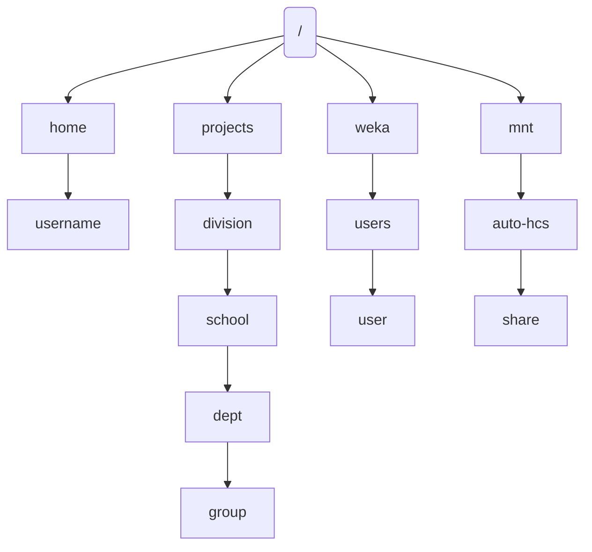

# Storage Overview
 
eResearch Support provides high-performance storage solutions for researchers at the University of Otago. These storage solutions are available on the [Research Cluster](../general/overview.md) to all researchers at the University of Otago upon application approval.
 
 

```mermaid
graph TD;
    root("/")
    root --> home
    home --> username
 
    root --> projects
    projects --> div1[division]
    div1 --> school1[school]
    school1 --> dept1[dept]
    dept1 --> group1[group]
 
    root --> weka
    weka --> users
    users --> user
 
    root --> mnt
    mnt --> auto-hcs
    auto-hcs --> share
```
 
 
|        | Home directory | projects | weka | High Capacity Storage (HCS)  |
| :----- | :-------------------------------------------- | :----------------------------------- | :----- |:---|
| __Ideal Use__ | Storage of scripts and configuration files |Research data you are working on      | Workflows that require very high speed data reading/writing  | Long term storage of important research data
|_Mount point_| `/home/<username>` | `/projects/<division>/<school>/<dept>/<group>/` | `/weka/users/<username>` | `/mnt/auto-hcs/<share name>`
| _Backed up_| :material-check: | :material-close: | :material-close: | :material-check: |
| _Default quota_ | 40 GB | Set by request on group creation | 0 GB (needs to be requested) | (Managed by Core Digital. Contact AskOtago) |
 
 
 
## Home directory

## /home/username
 
All users of the Otago Research Cluster have a home directory that is mounted  at ``/home/<username>``. Your home directory is intended for storing configuration files, scripts, and other smaller datasets that are used for computations.
 
* Home driectory advisory quotas are **30 GB**. You will receive an email at your Otago email address if your home directory reaches this threshold. 
* Home directory hard quotas are **{{ home_quota }}**. When you reach this limit you will not be able to write anymore data to your home directory. This hard quota allows for the backup of home directories.

Home directories are backed up. One snapshot per day for the last 7 days, one per week for the last 4 weeks, and one per month for the last 6 months are retained; older snapshots are pruned.

**A warning will be sent when you have reached 30GB of data stored in your home directory.**
 
!!! warning
 
    Note that the **/projects and /weka are not backed up** and it is the responsibility of the user to ensure their important data is safe. See [data transfer](data_transfer/data_transfer_overview.md) for options to move data you want to retain. If you need assistance with backing up your data, please email {{support_email}}.

 
## /projects
 
Projects storage is organised per department and group ``/projects/<division>/<department>/<Research_Group>``.
The projects storage is high-performance and is ideal for temporarily storing data that is **in use** for individuals and sharing within groups using the research infrastructure.
Note that this storage is not backed up and is the responsibility of the user to ensure their important data is backed up. We recommend having a copy of your data on HCS, and transferring a copy to `/projects/` for working on, then removing this working copy once finished and transferring results back to HCS.
 
To apply for a projects directory, please fill out the [Storage Signup](../getting_started/access/signup.md) form.
 
 
#### When to use /projects/ storage
 
* Large data sets
* Data sharing
* Checkpointing
   In long-running computations, checkpointing is used to save the state of a job at regular intervals.
* Data Staging
   Before running a job, input data can be staged (preloaded) into `/projects/` from HCS (or other sources) to ensure that the computation starts immediately without waiting for data transfers from slower storage systems.
* Temporary Data Processing
   For tasks that generate large amounts of temporary data, such as sorting, indexing, or image processing.
 
## /weka

WEKA is a high speed/throughput file storage system that can be utilised for workloads that need high throughput of data. Data stored on WEKA is intended to be only of a temporary nature while being processed.

To make use of of WEKA during a job, read or write data to `/tmp/` which has a shared 5TB limit across all users per node. Make sure to copy or move files you want to keep from `/tmp` to another location as all files created in `/tmp/` by your job will automatically be deleted upon the job ending.

For continued access between jobs, a separate path on WEKA storage can be allocated with a quota upon request to {{ support_email }}.

!!! related-pages "What Next?"
 
    - Find more information on [Weka](data_locations/weka.md)
    - Information on how to move your data on and off the Research cluster on [Data Transfer](data_transfer/data_transfer_overview.md)
### HCS directory
<!-- TODO Content -->

If you have an HCS share this is accessible from the cluster.

<!-- TODO add link to knowledgebase about HCS -->

!!! related-pages "What Next?"
 
    - Find more information on [HCS](../storage/data_locations/hcs.md)
    - Information on how to move your data on and off the Research cluster on [Data Transfer](data_transfer/data_transfer_overview.md)
 
 
## Backing up your data
 
 
The Research Storage (anything within /projects, /weka) is not backed up. It is the responsibility of the user to ensure their data is safe. RTIS recommends that users back up their data to the HCS.
 
Setting up Globus to automatically transfer data between the two storage solutions is a great way to ensure your data is backed up.
 
If you need assistance with backing up your data, please email {{support_email}}.
 
 
 
!!! related-pages "What Next?"
 
    Find more information on [Data Transfer](data_transfer/data_transfer_overview.md)
   
   
<!--This will need changing if the pages layout and content changes -->
  <!-- TODO Are these pages the next step or relevant? -->
